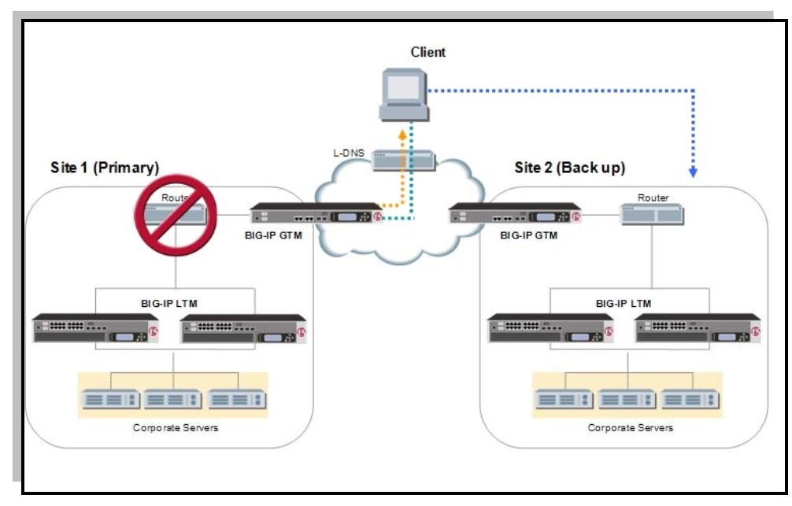

# The Need for Effective Load Balancing

Effectively serving millions of concurrent users is crucial for the success of any modern online business. However, slow or unavailable applications can negatively impact business outcomes. Many enterprises lose millions of dollars every year due to website sluggishness and downtime, caused by numerous factors including unhealthy servers, geographic distance between end users and servers,
slow DNS resolution times, cyber attacks, and more. Load balancers mitigate these performance and availability problems by uniformly dispersing web traffic across a network of servers, ensuring that no single server can be overwhelmed and become a bottleneck.

# GTM vs LTM – Difference between F5 Global & Local Traffic Manager

The Global Traffic Manager, aka GTM, is one of the cutting edge modules offered on F5 Networks BiG-IP platform. “GLobal” is the right word for this module because it has the ability to make load balancing decisions for systems all over the US and the World. You can think of the GTM as an intelligent DNS that is security minded. In other words its logic can make informed decisions on correlating a hostname to an IP address while keeping security in check.

Most things you do on the Internet or Private networks start with name resolution – so it makes sense if you’re going to load balance an application it would start at this layer – resolving names to IPs based on availability, Performance, and even Persistence.

Its important to note, traffic does not “route” through the GTM, the GTM simply tells you the best IP to route to based on metrics for the URL in question. That IP can be almost anything really, but usually its an actual server, or a virtual IP that fronts multiple servers. Like a traditional DNS architecture you usually have multiple GTMs in your architecture, this is for redundancy/availability.

The main configuration element in a GTM is called a Wide IP or WIP for short, or as my significant other likes to call it a “Wipey  . There are many configuration elements that work in concert with a WIP, but at the base of it all is the Wide IP. A WIP equates to the common URL youre load balancing, for example www.yourcompany.com. A pool or pools are usually attached to a WIP which contain the IPs its intelligently resolving. Like your run of the mill DNS server, the GTM does not tell the requester any information about ports. Though, the monitors associated with the pool members can indeed monitor availability or performance on ports.

# LTM – Local Traffic Manager Overview

The Local Traffic Manager, aka LTM, is the most popular module offered on F5 Networks BiG-IP platform. The real power of the LTM is it’s a Full Proxy, allowing you to augment client and server side connections. All while making informed load balancing decisions on availability, performance, and persistence. “Local” in the name is important, opposed to the GTM, traffic actually flows through the LTM to the servers it balances traffic to. Usually the servers it’s load balancing sit “locally” in the same data center as the LTM, though that is not a requirement. With SNAT configured on the VIP, if you can route to it you can load balance it – so it’s possible to have servers in different data centers be a part of the same pool in an LTM VIP.

The main configuration element on an LTM is the Virtual IP or VIP for short. There are a plethora of configuration elements that work with VIPs, but at the heart of the technology it’s a VIP they are all a part of. Like a WIP, VIPs equate to the URL you’re load balancing, but at its lowest level. Like a WIP it usually contains a pool with the servers it’s load balancing & monitor(s) to measure availability / performance.

# Some of the Key differences of the GTM vs LTM

The biggest difference between the GTM and LTM, as mentioned earlier, is traffic doesnt actually flow through the GTM to your servers.

The GTM is an intelligent name resolver, intelligently resolving names to IP addresses.

Once the GTM provides you with an IP to route to you’re done with the GTM until you ask it to resolve another name for you.

Similar to a usual DNS server, the GTM does not provide any port information in its resolution.

The LTM doesnt do any name resolution and assumes a DNS decision has already been made.

When traffic is directed to the LTM traffic flows directly through its’ full proxy architecture to the servers its load balancing.

Since the LTM is a full proxy its easy for it to listen on one port but direct traffic to multiple hosts listening on any port specified.

# How do the GTM & LTM work together?

The GTM and LTM can work together or they can be totally independent. If your organization owns both modules its usually using them together, and thats where the real power comes in.. They do this via a proprietary protocol called iQuery. iQuery, functioning on TCP port 4353, reports VIP availability / performance back to the GTMs. The GTMs can then dynamically resolve VIPs that live on an LTM(s).

**When a GTM has LTMs as servers in its’ configuration there is no need to monitor the actual VIP(s) with application monitors, as the LTM is doing that & iQuery **

# Maximum Availability Architecture

F5 LTM provides load balancing, high availability and service checks inside the datacenter.
F5 GTM works with the DNS infrastructure to monitor the health of all data centers, and route
users to the best available datacenter. Many of the Disaster Recovery architectures rely on GTM
to ensure users and customers always connect to the best operational Oracle application.

