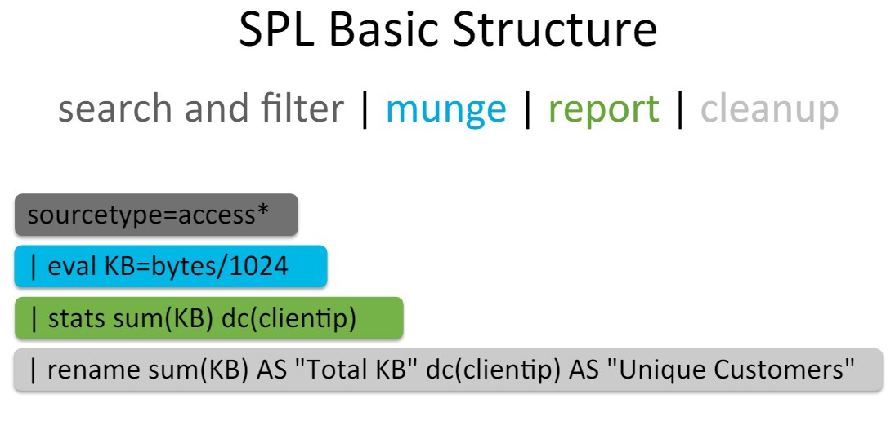

# Introduction

## Events

An **event** is a set of values associated with a timestamp. It is a single entry of data and can have one or multiple lines. An event can be a text document, a configuration file, an entire stack trace, and so on.

## Host, Source, and Source Type

Events with the same source types can come from different sources. For example, events from the file

```
source=/var/log/messages
```

and from a syslog input port

```
source=UDP:514
```

often share the source type,

```
sourcetype=linux_syslog
```

## Indexes

When data is added, Splunk software parses the data into individual events, extracts the timestamp, applies line-breaking rules, and stores the events in an  **index** . You can create new indexes for different inputs. By default, data is stored in the “main” index. Events are retrieved from one or more indexes during a search.

# Search Processing Language (SPL)

A Splunk search is a series of commands and arguments. Commands are chained together with a pipe “|” character to indicate that the output of one command feeds into the next command on the right.

```
search | command1 arguments1 | command2 arguments2 | ...
```

At the start of the search pipeline, is an implied search command to retrieve events from the index. Search requests are written with keywords, quoted phrases, Boolean expressions, wildcards, field name/value pairs, and comparison expressions. The AND operator is implied between search terms. For example:



## Search Command

The SPL2 `search` command retrieves events from one or more index datasets, or filters search results that are already in memory.

You can retrieve events from your datasets using keywords, quoted phrases, wildcards, and field-value expressions. When the `search` command is not the first command in the pipeline, it is used to filter the results of the previous command.

| Command          | Description                                                                           |
| ---------------- | ------------------------------------------------------------------------------------- |
| chart/ timechart | Returns results in a tabular output for (time-series) charting.                       |
| dedup            | Removes subsequent results that match a specified criterion.                          |
| eval             | Calculates an expression.                                                             |
| fields           | Removes fields from search results.                                                   |
| head/tail        | Returns the first/last N results.                                                     |
| lookup           | Adds field values from an external source.                                            |
| rename           | Renames a field. Use wildcards to specify multiple fields.                            |
| rex              | Specifies regular expression named groups to extract fields.                          |
| search           | Filters results to those that match the search expression.                            |
| sort             | Sorts the search results by the specified fields.                                     |
| stats            | Provides statistics, grouped optionally by fields.                                    |
| mstats           | Similar to stats but used on metrics instead of events.                               |
| table            | Specifies fields to keep in the result set. Retains data in tabular format.          |
| top/rare         | Displays the most/least common values of a field.                                     |
| transaction      | Groups search results into transactions.                                              |
| where            | Filters search results using eval expressions. Used to compare two different fields. |

Keyword searches are not case sensitive. The following search returns any event that contains the term `itemId`, including all variations of the capitalization of that term, such as `itemID`, `ITEMID`, and `itemid`.

`| search itemId`

To search for a phrase, enclose the phrase in double quotations. For example, this search returns only those events where the term `Windows` is immediately followed by a space and the number `10`:

`| search "Windows 10"`

**Search using field-value pairs**

When you are looking for a specific value in a field, identify the field in your search using a field-value pair.

The field name is case sensitive, the field value is not case sensitive.

For example, to search the `categoryId` field for the value `sports`, use this search:

`| search categoryId=sports`

**Searching for multiple keywords**

When you specify multiple terms to search for, there is an implied AND operator between each term. In the following example, the search looks only for events where the term `www2` exists and the `categoryId` field contains `sports`:

`| search www2 categoryId=sports`

This is the same as if you explicitly included the AND operator in your search, such as:

`| search www2 AND categoryId=sports`

**Using boolean and comparison operators**

This example shows field-value pair matching with boolean and comparison operators. This example searches for events with code values of either 10, 29, or 43 and any `host` that is not "localhost", and an `xqp` value that is greater than 5.

`| search (code=10 OR code=29 OR code=43) host!="localhost" xqp>5`

An alternative is to use the IN operator, because you are specifying multiple field-value pairs on the same field. The revised search is:

`| search code IN(10, 29, 43) host!="localhost" xqp>5`

**Using wildcards**

This example shows field-value pair matching with wildcards. This example searches for events from all of the web servers that have an HTTP client and server error status.

`| search host=webserver* (status=4* OR status=5*)`

An alternative is to use the IN operator, because you are specifying two field-value pairs on the same field. The revised search is:

`| search host=webserver* status IN(4*, 5*)`

**Using the NOT or != comparisons**

Searching with the boolean "NOT" comparison operator is not the same as using the "!=" comparison.

The following search returns everything except fieldA="value2", including all other fields.

`| search NOT fieldA="value2"`

The following search returns events where fieldA exists and does not have the value "value2".

`| search fieldA!="value2"`

If you use a wildcard for the value, `NOT fieldA=*` returns events where fieldA is null or undefined, and `fieldA!=*` never returns any events.

**Time Range**

index=main sourcetype=syslog error earliest=-1h latest=now

**Statistical and Aggregating**

index=main sourcetype=syslog error | top limit=10 host
index=main sourcetype=syslog error | stats count by host
index=main sourcetype=syslog error | chart count by host

index=main sourcetype=syslog error | sort - host
index=main sourcetype=syslog error | dedup host

index=<your index> code=A OR code=B | top empId


**Stats**

Ceates statistics from the search result

Provides various mathematical functions such as sum,avg ,max,count ,range etc.

index= <your index> status!=200 | stats count by status


**eval**

create a new field by evaluating the an expression

overwrite the field if alfeady exist 

many build in functions available


index = your index  | eval kbytes=byte/1024

create a new field kbyte  and store the value of expression byte/1024 on every event where byte is present

index = your index  | eval result =if (like (_raw,"%failed password%"),failed,success)

if evaluate a logical expression and assign the value based on result

like function uses % wild card

**Stats with eval**

index= <your index> |  stats count(eval(status=500)) AS "internal server error"

when using eval with stats , you must rename the aggregation using AS clause.


index = <your index> | fieldsummary maxval=5


**event stats**

index= <your index> | timechart span 1h avg(bytes) AS "response size" | evenstats avg(response size)


# Regex


| Character classes              |                                |
| ------------------------------ | ------------------------------ |
| .                              | any character except newline   |
| \w\d\s                         | word, digit, whitespace        |
| \W\D\S                         | not word, digit, whitespace    |
| [abc]                          | any of a, b, or c              |
| [^abc]                         | not a, b, or c                 |
| [a-g]                          | character between a & g        |
| Anchors                        |                                |
| ^abc$                          | start / end of the string      |
| \b\B                           | word, not-word boundary        |
| **Escaped characters**        |                                |
| \.\*\\                         | escaped special characters     |
| \t\n\r                         | tab, linefeed, carriage return |
| **Groups & Lookaround**       |                                |
| (abc)                          | capture group                  |
| \1                             | backreference to group #1      |
| (?:abc)                        | non-capturing group            |
| (?=abc)                        | positive lookahead             |
| (?!abc)                        | negative lookahead             |
| **Quantifiers & Alternation** |                                |
| a*a+a?                         | 0 or more, 1 or more, 0 or 1   |
| a{5}a{2,}                      | exactly five, two or more      |
| a{1,3}                         | between one & three            |
| a+?a{2,}?                      | match as few as possible       |
| ab                             | cd                             |
