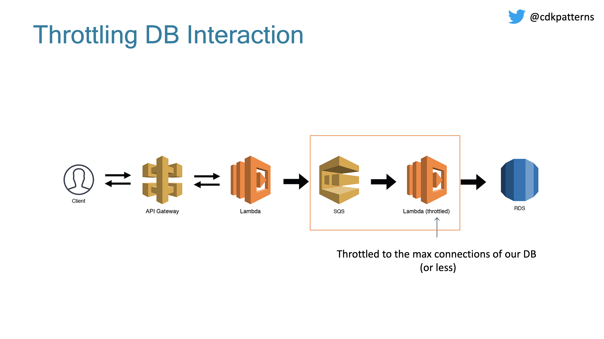

## What are webhooks?

Webhooks let you subscribe to events happening in a software system and automatically receive a delivery of data to your server whenever those events occur.

Webhooks are used to receive data as it happens, as opposed to polling an API (calling an API intermittently) to see if data is available. With webhooks, you only need to express interest in an event once, when you create the webhook.

To use webhooks effectively, the notifying system must possess the ability to register events and link them to a URL. When a particular event happens, like a buy order on a trading desk, the URL is called over the web with a payload of the event.

When an event that your webhook is subscribed to occurs, it will send an HTTP request with data about the event to the URL that you specified. If your server is set up to listen for webhook deliveries at that URL, it can take action when it receives one.

Webhooks are used in a wide range of scenarios, including:

* Triggering CI (continuous integration) pipelines on an external CI server. For example, to trigger CI in Jenkins or CircleCI when code is pushed to a branch.
* Sending notifications about events on GitHub to collaboration platforms. For example, sending a notification to Discord or Slack when there's a review on a pull request.
* Updating an external issue tracker like Jira.
* Deploying to a production server.
* Logging events as they happen on GitHub, for audit purposes.

## The Key Components of a Webhook Functioning

Here are the following key components of the webhook that help the webhook platform function. Let’s upgrade your knowledge on each separately.

* Event Source:

Event Source refers to the system that creates events, like a new message or a status change, prompting the webhook to activate. Basically, it is the origin of the trigger that sets the webhook in motion.

* Event Payload:

Payload is the data that gets transmitted during the event in the form of context and information.

* Webhook Endpoint:

The Webhook endpoint is the (second) URL where the event data is sent.

* Subscriber or Listener:

The subscriber or listener is the system or application that receives and processes the incoming data.

## About webhook delivery failures

A webhook delivery can fail for multiple reasons. For example, if your server is down or takes longer than specified time to respond, System will record the delivery as a failure.

Best practices for using webhooks

Subscribe to the minimum number of events

Use a webhook secret

Use HTTPS and SSL verification

IP addresses whitelisting

Respond within SLA

Redeliver missed deliveries

## Functional Requirement

* Customer could register webhook and they could register multiple webhook
* Support retry of webhook and minimize lost webhook as much as possible
* Provide observability to customers

## Non Functional Requirements

* 1B events pre day, which is equivalent to 10k qps for webhook trigger and request sending
* High availability
* The design should scale
* Security

## Some questions to clarify

* Do we allow event loss?
  * No, we should avoid event loss as much as possible.
* What delivery semantic do we provide? At least once, at most once or exactly once?
  * At least once
* If we resend webhook, could we resume the endpoint to be idempotent?
  * Yes, but we need to provide necessary info to achieve that

## High Level Design

I would skip the API design and the back envelop estimation for the sake of sanction of this post. We would start simple to first meet the functional requirements, and then improve the availability, scalability of our system

### Webhook Registration

We need to be able to let user to register webhook in our system. Below is a simple design of this part

The design is pretty simple, which we have web server to handle request from client and store the information in the  **webhook metadata database** . This metadata database is going to be used by the webhook delivery flow to figure out where to send the webhook request to.

For each webhook, we would generate a unique `webhook_id` as the unique identifier of each webhook. Besides that, we also need to store the `event_type` that this webhook listen to, as well as the `owner_id`. The `event_type` is a list of per-defined events that are available on our platform, which could be revealed via API document provided to customer. Besides that, we also need to store the `url` and `secret_token` in the database, to know where we should send the request to, as well as sending the request safely. The `secret_token` could be used for authentication and encryption for sending the webhook requests. In this schema, customers could register multiple webhook within the system.

One challenge here is that how to verify that customers have ownership on the urls they have provided. One common solution here is to send a test event to the endpoint they are providing, and ask them to verify they have received it; or by including a “challenge” in the request that the endpoints need to echo back (e.g. [Dropbox webhook](https://www.dropbox.com/developers/reference/webhooks#documentation)).

## Handling the verification request

The first request to your new webhook URI will be a verification request to confirm that Dropbox is communicating with the right service.

The verification request will be a `GET` request with a challenge parameter, which is a random string (e.g. `https://www.example.com/dropbox-webhook?challenge=abc123`). Your app should echo back the challenge parameter as the body of its response. Once Dropbox receives a valid response, the endpoint is considered to be a valid webhook, and Dropbox will begin sending notifications of file changes. Your app has up to ten seconds to respond to the verification request. Dropbox will not perform automatic retry for verification requests.

### Webhook Delivery

Next, let’s take a look at the webhook request deliver flow, which is the meaty part of the entire system. As mentioned earlier, the entire system is similar to notification system, and thus I use notification system as a template for this design. Below is a high level design of this flow

In this design, we adopted a *single responsibility strategy* and separate the delivery logic into several components

* **Webhook Controller** is responsible for processing the events (that are generated on our platform) and figuring out which endpoint we should send the data, as well as constructing the payload of the request. Here we assume that the events generated from our platform contains the `event_type` and `owner_id` information (because we don’t want the event that happened in our shop to be delivered to others’ endpoints). With `event_type` and `owner_id`, controller could retrieve the record from the **metadata database** and construct a webhook request task. Once the task is constructed, controller would write an entry into **Webhook Delivery Log** database to persistent this information, and set the `request_status` to `PENDING`, which we could leverage later for different retry strategy.
* **Message Queue** is adopted to store the webhook request task, which worker would consume. Using message queue bring the following benefits, which outperform the additional complexity they bring:
  * controller don’t need to wait for the current webhook request to be delivered to process the next one (it is async okay). This not only saves resource, but also increases robustness (e.g. if worker failed, controller could still make progress and put job onto the queue instead of being blocked).
  * if there is a burst of events come in, message queue could help buffer the increased volume of task so that worker won’t be throttling.
* **Webhook Worker** is responsible for consume webhook request task from the queue, and send the actual HTTP POST request to the endpoint. The payload of the HTTP POST request could be something like this

Worker would need to wait for the response from the endpoints, to know if the request has been successfully received. If received, then worker could update the record’s `request_status` in the *Webhook Delivery Log* database to `SUCCEED`; otherwise, different strategy of retry could be adopted to resent the webhook request. Supporting retry also means that we are providing **at least once** semantic, which could result in duplicated request sent to endpoints. We expect these endpoints need to be idempotent, which is doable with the `id` sent along with the HTTP POST request.

### Webhook Retry Strategy

One critical consideration for webhook system is the retry mechanism in case HTTP POST returns 4xx or 5xx code, or timeout. There are different retry strategies:

1. Retry immediately upon failure within a time range repeatedly, or until max retry limit
2. Exponential backoff within a time range (e.g. 24hrs), or until max retry limit

For example, [Strip](https://stripe.com/docs/webhooks#retries) would attempts to delivery webhook up to 3 days with an exponential backoff. *Option 1* is easy to implement, but the issue is that: if endpoint is returning error code, then it might take some time to mitigate the issue; immediate retry is likely to hit the same error, try again later time would be a better option.

In order to achieve exponential backoff retry mechanism, we would use a corn version  **Webhook Controller** , which dose not consume the events from upstream, but scan the **Webhook Delivery Log** database to identify the webhook requests that are still in `PENDING` status and have not exceed the max retry. For each of such request, the controller would bump their `retry_count` or `retry_timestamp`, and publish a new task into message queue.

The addition of this corn version **Webhook Controller** could also help mitigate worker failure issue. For example, if one webhook http request is consumed and removed from the message queue by a worker, but suddenly the worker failed; since the task is already removed from the queue, other worker won’t able to get it and process it again. However, the corn controller would notice in from the log that there is one `PENDING` request and schedule it to retry.

> Another option is that if message queue provide the capability to persistent messages, worker could commit the position of the message in the queue they have processed, and if worker failed, it could resume from its last committed position and process the message again

If for some endpoints, the failure is consistent for a certain time and over the threshold, we could temporarily mark the endpoints as `disabled` in the metadata’s `status` field to prevent new events from further deliver to them. And we could send alert email to customers to have them investigate into the issue. Once the issue is mitigated, the `status` could be changed back, and we could consumer the delivery log to resume the webhook request; or use other channel, such as dump the entire data that need to be delivered during this time and send it over to customer.

### Observability

Since we have already log the status of each webhook request in **Webhook Delivery Log** database, it is easy to support the observability. This could be implemented via having web application server to send a query to the database to aggregate the data and render it as a dashboard for customers. They could know how many webhook request have been sent, what’s the failure rate, etc.

### Security

Security is especially important in webhook system. In [webhook registration](https://pyemma.github.io/How-to-Design-Webhook/#webhook-registration) section, we authenticate that the endpoints belongs to users, we also need to authenticate ourself that the HTTP request is from us.

One common approach is to use [HMAC](https://en.wikipedia.org/wiki/HMAC) to sign the request with a shared secret with the user and sent the signature along with the request(e.g. Strip uses [this approach](https://stripe.com/docs/webhooks#verify-events)) and user could verify the signature with the shared secret. This shared secret could be auto generated upon user register webhook in our system, and show them to user in their monitor dashboard. This approach could also help us prevent replay attack, by including a timestamp used to expire webhook request.

Another approach, which is less common, is to get a token from the consumer and add it to the `Authorization` header for validation. For example, if the owner of the endpoint has authorization server, then before sending webhook request, we could first obtain a [JWT token](https://jwt.io/introduction) and store it within our metadata table `secret_token` and use it each time we need to send webhook request.

Besides the authentication problem, we also need to prevent the data we are sending could be read by others. There are also several options with different trade off:

* Avoid send sensitive information in the webhook payload. Instead, we could only send some entity id which is totally meaningless and ask customer to pull data again via other API. Pros is that this is the most safe approach, and the cons is that customer experience is worst
* Another option is to encrypt the data with a shared secret key, which is only known between webhook provider and webhook consumer. A follow up of this question is how could we share this secret key safely between customer and provider over the unsafe network? Here we could use RSA encryption. (This is a general practice, RSA is safe, since only yourself know the private key; but the amount of data could be transferred via RSA is limited. So it makes since to use RSA to send another secret key, which is used for encryption/decryption of large volume of data)
* Sending data with HTTPS and certificate pinning is also an option to safely transfer sensitive data, but this would have some performance hurt and require customer to have HTTPS setup such as CA

### High Availability

Let’s see if there is any single point of failure in our current design. What comes to us first is the database and message queue. There are multiple replication strategy here we could use, each comes with different trade off:

* For  **Webhook Metadata Database** , we could adopt single leader strategy, and have 2 followers. The followers could use synchronized replication, which provides good consistency, but the write throughput on the leader would be low; while if we use async approach, leader could handle more write request while could lead to consistency issues among leader and followers. If we are building for a geo webhook system, we might also consider multi-leader strategy, with better write request severing based on location and annoy of write conflict.
* For  **Webhook Delivery Log Database** , besides the aforementioned strategy, we could also consider the quorum based replication, which provides the best write throughput and eventual consistency is acceptable in this case. (Q: what would be the worst case here).
* For  **Message Queue** , similar to the database, we could also have replica setup so that the message is written to multiple node instead of single one. Also, even if we only have a single node queue and it failed. Since we are storing all scheduled webhook request in the  **Webhook Delivery Log Database** , the **webhook controller (corn)** would identify the abnormal ones and try to reschedule them.

For other components such as  **web app server** , **webhook controller** and  **webhook worker** , they could be stateless. If a node fails, there would be other nodes available to continue the work.

### Scalability

For scalability, we could horizontally scale  **web app server** , **webhook controller** and **webhook worker** by adding more nodes into the cluster. For database, we could shard it to scale if the total volume of data is too large to fit onto a single machine. Message queue could also be horizontally sharded by increase the number of partitions.

There could be hotspot. For example, my awesome keyboard is so popular that lots of customer is visiting my shop and vast amount of events are triggered. To handle the hotspot, we could use a dynamic config to redirect the traffic of hotspot to specific cluster of machines, instead of starving the quote with other customers; or we could further shard the hotspot by some approach such suffix with numbers.

### Other optimization

There are couple of other optimizations we could add to our system to make it more robust

* we could have load balances in front of webhook controller to route based on machine utilization; also we could integrate the rate limit here to prevent abuse of the system (such as bot triggered events)
* we could add a layer of cache to reduce the amount of read to metadata
* we could add a rate limiter to help control the http request we send to customers; for some customers that have high security requirement, they might only trust http request sent from specific IPs, we could have dedicated VPC to support that needs
* for observability, we could add some pre-compute mechanism to reduce the volume of data that the query need to scan; for example T-1 snapshot + on demand query on T

Here is our final design 

## The Scalable Webhook

If you're building a webhook, the traffic can often be unpredictable. This is fine for Lambda, but if you're using a "less-scalable" backend like RDS, you might just run into some bottlenecks. There are [ways to manage this](https://www.jeremydaly.com/manage-rds-connections-aws-lambda/), but now that Lambda supports [SQS triggers](https://www.jeremydaly.com/serverless-consumers-with-lambda-and-sqs-triggers/), we can throttle our workloads by queuing the requests and then using a throttled (low concurrency) Lambda function to work through our queue. Under most circumstances, your throughput should be near real time. If there is some heavy load for a period of time, you might experience some small delays as the throttled Lambda chews through the messages. SQS triggers for Lambda functions [now work correctly with throttling](https://www.jeremydaly.com/serverless-consumers-with-lambda-and-sqs-triggers/), so it is no longer necessary to manage your own redrive policy.

## High Level Description

You would use this pattern when you have a non serverless resource like an RDS DB in direct contact with a serverless resource like a lambda. You need to make sure that your serverless resource doesn't scale up to an amount that it DOS attacks your non serverless resource.

This is done by putting a queue between them and having a lambda with a throttled concurrency policy pull items off the queue and communicate with your serverless resource at a rate it can handle.

**NOTE:** For this pattern in the cdk deployable construct I have swapped RDS for DynamoDB.

Why? Because it is significantly cheaper/faster for developers to deploy and maintain, I also don't think we lose the essence of the pattern with this swap given we still do the pub/sub deduplication via SQS/Lambda and throttle the subscription lambda. RDS also introduces extra complexity in that it needs to be deployed in a VPC. I am slightly worried developers would get distracted by the extra RDS logic when the main point is the pattern. A real life implementation of this pattern could use RDS MySQL or it could be a call to an on-prem mainframe, the main purpose of the pattern is the throttling to not overload the scale-limited resource.

If we weren't using DynamoDB, we would need to know the max connections limit configured for our instance size:

We need to slow down the amount of direct requests to our DB somehow, that is where the scalable webhook comes in:

We can use SQS to hold all requests in a queue as soon as they come in. Again, SQS will have limits:

120,000 in flight messages with an unlimited backlog I think will be effective enough as a buffer.

Now we have our messages in a queue but we need to subscribe to the queue and insert the records into the DB. To do this we create a throttled lambda where we set the max number of concurrent executions to whatever scale we are happy with. This should be less than the max connections on our DB and should take into account any other Lambdas running in this account.

One final improvement that we could make if implementing this in a production system is to delete the Lambda between the API Gateway and SQS. You can do a direct integration which will reduce costs and latency:

## How to test pattern

When you deploy this you will have an API Gateway where any url is routed through to the publish lambda. If you modify the url from / to say /hello this url will be sent as a message via sqs to a lambda which will insert "hello from /hello" into dynamodb as a message. You can track the progress of your message at every stage through cloudwatch as logs are printed, you can view the contents of dynamo in the console and the contents of sqs in the console. You should also notice that SQS can include duplicate messages but in those instances you don't get two identical records in DynamoDB as we used an id we generated in the message as the key
