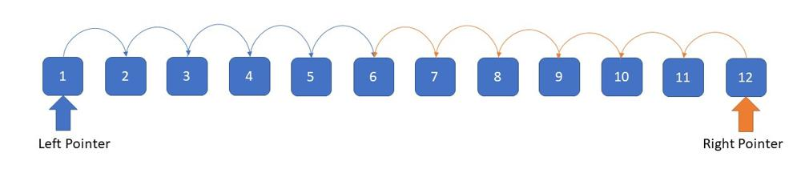
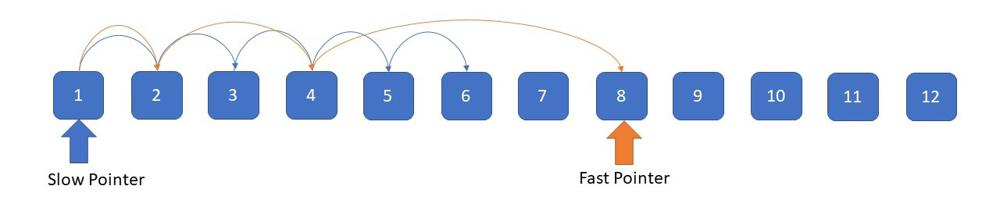
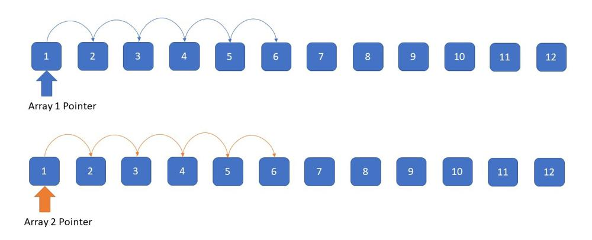

# Two Pointers Patterns

## Running from both ends of an array

The first type of problems are, having two pointers at left and right end of array, then moving them to the center while processing something with them.



* 2 Sum problem
  (*) [https://leetcode.com/problems/two-sum-ii-input-array-is-sorted/](https://leetcode.com/problems/two-sum-ii-input-array-is-sorted/)
  [https://leetcode.com/problems/3sum/](https://leetcode.com/problems/3sum/)
  [https://leetcode.com/problems/4sum/](https://leetcode.com/problems/4sum/)
  [https://leetcode.com/problems/number-of-subsequences-that-satisfy-the-given-sum-condition/](https://leetcode.com/problems/number-of-subsequences-that-satisfy-the-given-sum-condition/)
  [https://leetcode.com/problems/two-sum-iv-input-is-a-bst/](https://leetcode.com/problems/two-sum-iv-input-is-a-bst/)
  [https://leetcode.com/problems/sum-of-square-numbers/](https://leetcode.com/problems/sum-of-square-numbers/)
  [https://leetcode.com/problems/boats-to-save-people/](https://leetcode.com/problems/boats-to-save-people/)
  [https://leetcode.com/problems/minimize-maximum-pair-sum-in-array/](https://leetcode.com/problems/minimize-maximum-pair-sum-in-array/)
  [https://leetcode.com/problems/3sum-with-multiplicity/](https://leetcode.com/problems/3sum-with-multiplicity/)
* Trapping Water
  (*) [https://leetcode.com/problems/trapping-rain-water/](https://leetcode.com/problems/trapping-rain-water/)
  [https://leetcode.com/problems/container-with-most-water/](https://leetcode.com/problems/container-with-most-water/)
* Next Permutation
  (*) [https://leetcode.com/problems/next-permutation/](https://leetcode.com/problems/next-permutation/)
  [https://leetcode.com/problems/next-greater-element-iii/](https://leetcode.com/problems/next-greater-element-iii/)
  [https://leetcode.com/problems/minimum-adjacent-swaps-to-reach-the-kth-smallest-number/](https://leetcode.com/problems/minimum-adjacent-swaps-to-reach-the-kth-smallest-number/)
* Reversing / Swapping
  [https://leetcode.com/problems/valid-palindrome/](https://leetcode.com/problems/valid-palindrome/)
  (*) [https://leetcode.com/problems/reverse-string/](https://leetcode.com/problems/reverse-string/)
  [https://leetcode.com/problems/reverse-vowels-of-a-string/](https://leetcode.com/problems/reverse-vowels-of-a-string/)
  [https://leetcode.com/problems/valid-palindrome-ii/](https://leetcode.com/problems/valid-palindrome-ii/)
  [https://leetcode.com/problems/reverse-only-letters/](https://leetcode.com/problems/reverse-only-letters/)
  [https://leetcode.com/problems/remove-element/](https://leetcode.com/problems/remove-element/)
  [https://leetcode.com/problems/sort-colors/](https://leetcode.com/problems/sort-colors/)
  [https://leetcode.com/problems/flipping-an-image/](https://leetcode.com/problems/flipping-an-image/)
  [https://leetcode.com/problems/squares-of-a-sorted-array/](https://leetcode.com/problems/squares-of-a-sorted-array/)
  [https://leetcode.com/problems/sort-array-by-parity/](https://leetcode.com/problems/sort-array-by-parity/)
  [https://leetcode.com/problems/sort-array-by-parity-ii/](https://leetcode.com/problems/sort-array-by-parity-ii/)
  [https://leetcode.com/problems/pancake-sorting/](https://leetcode.com/problems/pancake-sorting/)
  [https://leetcode.com/problems/reverse-prefix-of-word/](https://leetcode.com/problems/reverse-prefix-of-word/)
  [https://leetcode.com/problems/reverse-string-ii/](https://leetcode.com/problems/reverse-string-ii/)
  [https://leetcode.com/problems/reverse-words-in-a-string/](https://leetcode.com/problems/reverse-words-in-a-string/)
  [https://leetcode.com/problems/reverse-words-in-a-string-iii/](https://leetcode.com/problems/reverse-words-in-a-string-iii/)
* Others
  [https://leetcode.com/problems/bag-of-tokens/](https://leetcode.com/problems/bag-of-tokens/)
  [https://leetcode.com/problems/di-string-match/](https://leetcode.com/problems/di-string-match/)
  [https://leetcode.com/problems/minimum-length-of-string-after-deleting-similar-ends/](https://leetcode.com/problems/minimum-length-of-string-after-deleting-similar-ends/)
  [https://leetcode.com/problems/sentence-similarity-iii/](https://leetcode.com/problems/sentence-similarity-iii/)
  [https://leetcode.com/problems/find-k-closest-elements/](https://leetcode.com/problems/find-k-closest-elements/)
  [https://leetcode.com/problems/shortest-distance-to-a-character/](https://leetcode.com/problems/shortest-distance-to-a-character/)

## Slow & Fast Pointers

Next type is using two pointers with different speed of movement. Typically they starts from the left end, then the first pointer advances fast and give some feedback to the slow pointer and do some calculation.



* Linked List Operations
  (*) [https://leetcode.com/problems/linked-list-cycle/](https://leetcode.com/problems/linked-list-cycle/)
  [https://leetcode.com/problems/linked-list-cycle-ii/](https://leetcode.com/problems/linked-list-cycle-ii/)
  [https://leetcode.com/problems/remove-nth-node-from-end-of-list/](https://leetcode.com/problems/remove-nth-node-from-end-of-list/)
  [https://leetcode.com/problems/rotate-list/](https://leetcode.com/problems/rotate-list/)
  [https://leetcode.com/problems/reorder-list/](https://leetcode.com/problems/reorder-list/)
  [https://leetcode.com/problems/palindrome-linked-list/](https://leetcode.com/problems/palindrome-linked-list/)
* Cyclic Detection
  (*) [https://leetcode.com/problems/find-the-duplicate-number/](https://leetcode.com/problems/find-the-duplicate-number/)
  [https://leetcode.com/problems/circular-array-loop/](https://leetcode.com/problems/circular-array-loop/)
* (*) [https://leetcode.com/problems/number-of-subarrays-with-bounded-maximum/](https://leetcode.com/problems/number-of-subarrays-with-bounded-maximum/)
  [https://leetcode.com/problems/find-k-th-smallest-pair-distance/](https://leetcode.com/problems/find-k-th-smallest-pair-distance/)
  [https://leetcode.com/problems/moving-stones-until-consecutive-ii/](https://leetcode.com/problems/moving-stones-until-consecutive-ii/)
  [https://leetcode.com/problems/count-pairs-of-nodes/](https://leetcode.com/problems/count-pairs-of-nodes/)
  [https://leetcode.com/problems/count-binary-substrings/](https://leetcode.com/problems/count-binary-substrings/)
  [https://leetcode.com/problems/k-diff-pairs-in-an-array/](https://leetcode.com/problems/k-diff-pairs-in-an-array/)
* Rotation
  (*) [https://leetcode.com/problems/rotating-the-box/](https://leetcode.com/problems/rotating-the-box/)
  [https://leetcode.com/problems/rotate-array/](https://leetcode.com/problems/rotate-array/)
* String
  (*) [https://leetcode.com/problems/string-compression/](https://leetcode.com/problems/string-compression/)
  [https://leetcode.com/problems/last-substring-in-lexicographical-order/](https://leetcode.com/problems/last-substring-in-lexicographical-order/)
* Remove Duplicate
  (*) [https://leetcode.com/problems/remove-duplicates-from-sorted-array/](https://leetcode.com/problems/remove-duplicates-from-sorted-array/)
  [https://leetcode.com/problems/remove-duplicates-from-sorted-array-ii/](https://leetcode.com/problems/remove-duplicates-from-sorted-array-ii/)
  [https://leetcode.com/problems/remove-duplicates-from-sorted-list-ii/](https://leetcode.com/problems/remove-duplicates-from-sorted-list-ii/)
  [https://leetcode.com/problems/duplicate-zeros/](https://leetcode.com/problems/duplicate-zeros/)
* Others
  [https://leetcode.com/problems/statistics-from-a-large-sample/](https://leetcode.com/problems/statistics-from-a-large-sample/)
  [https://leetcode.com/problems/partition-labels/](https://leetcode.com/problems/partition-labels/)
  [https://leetcode.com/problems/magical-string/](https://leetcode.com/problems/magical-string/)
  [https://leetcode.com/problems/friends-of-appropriate-ages/](https://leetcode.com/problems/friends-of-appropriate-ages/)
  [https://leetcode.com/problems/longest-mountain-in-array/](https://leetcode.com/problems/longest-mountain-in-array/)
  [https://leetcode.com/problems/shortest-subarray-to-be-removed-to-make-array-sorted/](https://leetcode.com/problems/shortest-subarray-to-be-removed-to-make-array-sorted/)

## Running from beginning of 2 arrays / Merging 2 arrays



* Sorted arrays
  (*) [https://leetcode.com/problems/merge-sorted-array/](https://leetcode.com/problems/merge-sorted-array/)
  [https://leetcode.com/problems/heaters/](https://leetcode.com/problems/heaters/)
  [https://leetcode.com/problems/find-the-distance-value-between-two-arrays/](https://leetcode.com/problems/find-the-distance-value-between-two-arrays/)
* Intersections/LCA like
  (*) [https://leetcode.com/problems/intersection-of-two-linked-lists/](https://leetcode.com/problems/intersection-of-two-linked-lists/)
  [https://leetcode.com/problems/intersection-of-two-arrays/](https://leetcode.com/problems/intersection-of-two-arrays/)
  [https://leetcode.com/problems/intersection-of-two-arrays-ii/](https://leetcode.com/problems/intersection-of-two-arrays-ii/)
* SubString
  (*) [https://leetcode.com/problems/implement-strstr/](https://leetcode.com/problems/implement-strstr/)
  [https://leetcode.com/problems/longest-word-in-dictionary-through-deleting/](https://leetcode.com/problems/longest-word-in-dictionary-through-deleting/)
  [https://leetcode.com/problems/long-pressed-name/](https://leetcode.com/problems/long-pressed-name/)
  [https://leetcode.com/problems/longest-uncommon-subsequence-ii/](https://leetcode.com/problems/longest-uncommon-subsequence-ii/)
  [https://leetcode.com/problems/compare-version-numbers/](https://leetcode.com/problems/compare-version-numbers/)
  [https://leetcode.com/problems/camelcase-matching/](https://leetcode.com/problems/camelcase-matching/)
  [https://leetcode.com/problems/expressive-words/](https://leetcode.com/problems/expressive-words/)
* Median Finder
  (*) [https://leetcode.com/problems/find-median-from-data-stream/](https://leetcode.com/problems/find-median-from-data-stream/)
* Meet-in-the-middle / Binary Search
  (*) [https://leetcode.com/problems/partition-array-into-two-arrays-to-minimize-sum-difference/](https://leetcode.com/problems/partition-array-into-two-arrays-to-minimize-sum-difference/)
  [https://leetcode.com/problems/closest-subsequence-sum/](https://leetcode.com/problems/closest-subsequence-sum/)
  [https://leetcode.com/problems/ways-to-split-array-into-three-subarrays/](https://leetcode.com/problems/ways-to-split-array-into-three-subarrays/)
  [https://leetcode.com/problems/3sum-closest/](https://leetcode.com/problems/3sum-closest/)
  [https://leetcode.com/problems/valid-triangle-number/](https://leetcode.com/problems/valid-triangle-number/)
* Others
  [https://leetcode.com/problems/shortest-unsorted-continuous-subarray/](https://leetcode.com/problems/shortest-unsorted-continuous-subarray/)
  [https://leetcode.com/problems/most-profit-assigning-work/](https://leetcode.com/problems/most-profit-assigning-work/)
  [https://leetcode.com/problems/largest-merge-of-two-strings/](https://leetcode.com/problems/largest-merge-of-two-strings/)
  [https://leetcode.com/problems/swap-adjacent-in-lr-string/](https://leetcode.com/problems/swap-adjacent-in-lr-string/)

## Split & Merge of an array / Divide & Conquer

The last one is similiar to previous category but there is one thing is added. First, you need to split the given list into 2 separate lists and then do two pointers approach to merge or unify them. There aren't many tasks here.


* Partition
  (*) [https://leetcode.com/problems/partition-list/](https://leetcode.com/problems/partition-list/)
* Sorting
  (*) [https://leetcode.com/problems/sort-list/](https://leetcode.com/problems/sort-list/)

# Binary Search Patterns

Binary Search is quite easy to understand conceptually. Basically, it splits the search space into two halves and only keep the half that probably has the search target and throw away the other half that would not possibly have the answer. In this manner, we reduce the search space to half the size at every step, until we find the target. Binary Search helps us reduce the search time from linear O(n) to logarithmic O(log n).

## Generalized Binary Search

Before we look at the abstract ideas of binary search, let's see the code first:

```jsx
    public int search(int[] nums, int target) {
        int low = 0;
        int high = nums.length - 1;
        while(low <= high){
            int mid = low + (high - low) / 2;
            if(nums[mid] == target){
                return mid;
            }
            else if(nums[mid] < target){
                low = mid + 1;
            }
            else{
                high = mid - 1;
            }
        }
        return -1;
    }
}
```

## The fundamental idea

**1. `lo` & `hi`**
We define two variables, let's call them `lo` and `hi` . They will store array indexes and they work like a boundary such that we will only be looking at elements inside the boundary.
Normally, we would want initialize the boundary to be the entire array.

```javascript
let lo =0, hi = nums.length-1;
```

**2. `mid`**
The `mid` variable indicates the middle element within the boundary. It separates our boundary into 2 parts. Remember how I said binary search works by keep cutting the elements in half, the `mid` element works like a traffic police, it indicates us which side do we want to cut our boundary to.

Note when an array has even number of elements, it's your decision to use either the left `mid` (lower `mid`) or the right `mid` (upper mid)

```javascript
let mid = lo +Math.floor((hi - lo)/2);// left/lower mid

let mid = lo +Math.floor((hi - lo +1)/2);// right/upper mid
```

**3. Comparing the target to `mid`**
By comparing our target to `mid`, we can identify which side of the boundary does the target belong. For example, If our target is greater than `mid`, this means it must exist in the right of `mid` . In this case, there is no reason to even keep a record of all the numbers to its left. And this is the fundamental mechanics of binary search - keep shrinking the boundary.

```javascript
if(target < nums[mid]){
	hi = mid -1
}else{
	lo = mid; 
}
```

**4. Keep the loop going**
Lastly, we use a while loop to keep the search going:

```javascript
while(lo < hi){...}
```

The while loop only exits when `lo == hi`, which means there's only one element left. And if we implemented everything correctly, that only element should be our answer(assume if the target is in the array).

## The pattern

It may seem like binary search is such a simple idea, but when you look closely in the code, we are making some serious decisions that can completely change the behavior of our code.
These decisions include:

1. Do I use left or right `mid`?
2. Do I use `<` or `<=` , `>` or `>=`?
3. How much do I shrink the boundary? is it `mid` or `mid - 1` or even `mid + 1` ?
4. ...

And just by messing up one of these decisions, either because you don't understand it completely or by mistake, it's going to break your code.
To solve these decision problems, I use the following set of rules to always keep me away from trouble, most importantly, it makes my code more consistent and predictable in all edge cases.

**1. Choice of `lo` and `hi`, aka the boundary**
Normally, we set the initial boundary to the number of elements in the array

```javascript
let lo =0, hi = nums.length-1;
```

But this is not always the case.
We need to remember: the boundary is the range of elements we will be searching from.
The initial boundary should include **ALL** the elements, meaning all the possible answers should be included. Binary search can be applied to none array problems, such as Math, and this statement is still valid.

For example, In LeetCode 35, the question asks us to find an index to **insert** into the array.
It is possible that we insert after the last element of the array, thus the complete range of boundary becomes

```javascript
let lo =0, hi = nums.length;
```

**2. Calculate `mid`**
Calculating mid can result in overflow when the numbers are extremely big. I ll demonstrate a few ways of calculating `mid` from the worst to the best.

```javascript
let mid =Math.floor((lo + hi)/2)// worst, very easy to overflow

let mid = lo +Math.floor((hi - lo)/2)// much better, but still possible

let mid =(lo + hi)>>>1// the best, but hard to understand
```

When we are dealing with even elements, it is our choice to pick the left `mid` or the right `mid` , and as I ll be explaining in a later section, a bad choice will lead to an infinity loop.

```javascript
let mid = lo +Math.floor((hi - lo)/2)// left/lower mid

let mid = lo +Math.floor((hi - lo +1)/2)// right/upper mid
```

**3. How do we shrink boundary**
I always try to keep the logic as simple as possible, that is a single pair of `if...else`. But what kind of logic are we using here? My rule of thumb is always use a logic that you can **exclude** `mid`.
Let's see an example:

```javascript
if(target < nums[mid]){
	hi = mid -1
}else{
	lo = mid; 
}
```

Here, if the target is less than `mid`, there's no way `mid` will be our answer, and we can exclude it very confidently using `hi = mid - 1`. Otherwise, `mid` still has the potential to be the target, thus we include it in the boundary `lo = mid`.
On the other hand, we can rewrite the logic as:

```javascript
if(target > nums[mid]){
	lo = mid +1;// mid is excluded
}else{
	hi = mid;// mid is included
}
```

**4. while loop**
To keep the logic simple, I always use

```javascript
while(lo < hi){...}
```

Why? Because this way, the only condition the loop exits is `lo == hi`. I know they will be pointing to the same element, and I know that element always exists.

**5. Avoid infinite loop**
Remember I said a bad choice of left or right `mid` will lead to an infinite loop? Let's tackle this down.
Example:

```javascript
let mid = lo +((hi - lo)/2);// Bad! We should use right/upper mid!

if(target < nums[mid]){
	hi = mid -1
}else{
	lo = mid; 
}
```

Now, imagine when there are only 2 elements left in the boundary. If the logic fell into the `else` statement, since we are using the left/lower mid, it's simply not doing anything. It just keeps shrinking itself to itself, and the program got stuck.
We have to keep in mind that, the choice of `mid` and our shrinking logic has to work together in a way that every time, at least 1 element is excluded.

```javascript
let mid = lo +((hi - lo +1)/2);// Bad! We should use left/lower mid!

if(target > nums[mid]){
	lo = mid +1;// mid is excluded
}else{
	hi = mid;// mid is included
}
```

So when your binary search is stuck, think of the situation when there are only 2 elements left. Did the boundary shrink correctly?

## Key takeaways

My rule of thumb when it comes to binary search:

1. Include **ALL** possible answers when initialize `lo` & `hi`
2. Don't overflow the `mid` calculation
3. Shrink boundary using a logic that will **exclude** mid
4. Avoid infinite loop by picking the correct `mid` and shrinking logic
5. Always think of the case when there are 2 elements left

*Because this problem is a failrly easy, the implementions may be pretty straight forward and you may wonder why do I need so many rules. However, binary search problems can get much much more complex, and without consistent rules, it's very hard to write predictable code. In the end, I would say everybody has their own style of binary serach, find the style that works for you!*

# Maximum Sliding Window Patterns

### Problems Solvable using this pattern

* [3. Longest Substring Without Repeating Characters](https://leetcode.com/problems/longest-substring-without-repeating-characters/discuss/1499836/C%2B%2B-Sliding-Window-(%2B-Cheat-Sheet))
* [159. Longest Substring with At Most Two Distinct Characters (Medium)](https://leetcode.com/problems/longest-substring-with-at-most-two-distinct-characters/discuss/1499839/C%2B%2B-Sliding-Window-(%2B-Cheat-Sheet))
* [340. Longest Substring with At Most K Distinct Characters](https://leetcode.com/problems/longest-substring-with-at-most-k-distinct-characters/discuss/1499842/C%2B%2B-Sliding-Window-(%2B-Cheat-Sheet))
* [424. Longest Repeating Character Replacement](https://leetcode.com/problems/longest-repeating-character-replacement/discuss/1499834/C%2B%2B-Sliding-Window-(%2B-Cheat-Sheet))
* [487. Max Consecutive Ones II](https://leetcode.com/problems/max-consecutive-ones-ii/discuss/1499844/C%2B%2B-Sliding-Window-(%2B-Cheat-Sheet))
* [713. Subarray Product Less Than K](https://leetcode.com/problems/subarray-product-less-than-k/discuss/1501834/C%2B%2B-Sliding-Window-(%2B-Cheat-Sheet))
* [1004. Max Consecutive Ones III](https://leetcode.com/problems/max-consecutive-ones-iii/discuss/1504260/C%2B%2B-Sliding-Window-(%2B-Cheat-Sheet))
* [1208. Get Equal Substrings Within Budget (Medium)](https://leetcode.com/problems/get-equal-substrings-within-budget/discuss/1529234/C%2B%2B-Sliding-Window-(%2B-Cheat-Sheet))
* [1493. Longest Subarray of 1&#39;s After Deleting One Element](https://leetcode.com/problems/longest-subarray-of-1s-after-deleting-one-element/discuss/1504267/C%2B%2B-Sliding-Window-(%2B-Cheat-Sheet))
* [1695. Maximum Erasure Value](https://leetcode.com/problems/maximum-erasure-value/discuss/1504271/C%2B%2B-Sliding-Window-(%2BCheat-Sheet))
* [1838. Frequency of the Most Frequent Element](https://leetcode.com/problems/frequency-of-the-most-frequent-element/discuss/1175088/C%2B%2B-Maximum-Sliding-Window-Cheatsheet-Template!)
* [2009. Minimum Number of Operations to Make Array Continuous](https://leetcode.com/problems/minimum-number-of-operations-to-make-array-continuous/discuss/1470857/C%2B%2B-Sliding-Window)
* [2024. Maximize the Confusion of an Exam](https://leetcode.com/problems/maximize-the-confusion-of-an-exam/discuss/1499033/c-sliding-window-cheat-sheet)

### Pattern 1: Sliding Window (Shrinkable)

The best template I've found so far:

```cpp
int i =0, j =0, ans =0;
for(; j < N;++j){
// CODE: use A[j] to update state which might make the window invalid
for(;invalid();++i){// when invalid, keep shrinking the left edge until it's valid again
// CODE: update state using A[i]
}
    ans =max(ans, j - i +1);// the window [i, j] is the maximum window we've found thus far
}
return ans;
```

Essentially, we want to **keep the window valid** at the end of each outer `for` loop.

**Solution for this question:**

1. What should we use as the `state`? It should be the sum of numbers in the window
2. How to determine `invalid`? The window is invalid if `(j - i + 1) * A[j] - sum > k`.

```cpp
// OJ: https://leetcode.com/problems/frequency-of-the-most-frequent-element/
// Author: github.com/lzl124631x
// Time: O(NlogN)
// Space: O(1)
classSolution{
public:
intmaxFrequency(vector<int>& A,int k){
sort(begin(A),end(A));
long i =0, N = A.size(), ans =1, sum =0;
for(int j =0; j < N;++j){
            sum += A[j];
while((j - i +1)* A[j]- sum > k) sum -= A[i++];
            ans =max(ans, j - i +1);
}
return ans;
}
};
```

 **FAQ** :

* Why is the time complexity `O(NlogN)`?
  The sorting takes `O(NlogN)`. The two pointer part only takes `O(N)` because both the pointers `i` and `j` traverse the array ONLY ONCE.
* Why is `(j - i + 1) * A[j] - sum <= k` valid?
  `(j - i + 1)` is the length of the window `[i, j]`. We want to increase all the numbers in the window to equal `A[j]`, the number of operations needed is `(j - i + 1) * A[j] - sum` which should be `<= k`. For example, assume the window is `[1,2,3]`, increasing all the numbers to `3` will take `3 * 3 - (1 + 2 + 3)` operations.

### Pattern 2: Sliding Window (Non-shrinkable)

```cpp
int i =0, j =0;
for(; j < N;++j){
// CODE: use A[j] to update state which might make the window invalid
if(invalid()){// Increment the left edge ONLY when the window is invalid. In this way, the window GROWs when it's valid, and SHIFTs when it's invalid
// CODE: update state using A[i]
++i;
}
// after `++j` in the for loop, this window `[i, j)` of length `j - i` MIGHT be valid.
}
return j - i;// There must be a maximum window of size `j - i`.
```

Essentially, we GROW the window when it's valid, and SHIFT the window when it's invalid.

Note that there is only a SINGLE `for` loop now!

**Solution for this question:**

```cpp
// OJ: https://leetcode.com/problems/frequency-of-the-most-frequent-element/
// Author: github.com/lzl124631x
// Time: O(NlogN)
// Space: O(1)
classSolution{
public:
intmaxFrequency(vector<int>& A,int k){
sort(begin(A),end(A));
long i =0, j =0, N = A.size(), sum =0;
for(; j < N;++j){
            sum += A[j];
if((j - i +1)* A[j]- sum > k) sum -= A[i++];
}
return j - i;
}
};
```

### Apply these templates to other problems

#### [1493. Longest Subarray of 1&#39;s After Deleting One Element (Medium)](https://leetcode.com/problems/longest-subarray-of-1s-after-deleting-one-element/)

##### Sliding Window (Shrinkable)

1. What's `state`? `cnt` as the number of `0`s in the window.
2. What's `invalid`? `cnt > 1` is invalid.

```cpp
// OJ: https://leetcode.com/problems/longest-subarray-of-1s-after-deleting-one-element/
// Author: github.com/lzl124631x
// Time: O(N)
// Space: O(1)
classSolution{
public:
intlongestSubarray(vector<int>& A){
int i =0, j =0, N = A.size(), cnt =0, ans =0;
for(; j < N;++j){
            cnt += A[j]==0;
while(cnt >1) cnt -= A[i++]==0;
            ans =max(ans, j - i);// note that the window is of size `j - i + 1`. We use `j - i` here because we need to delete a number.
}
return ans;
}
};
```

##### Sliding Window (Non-shrinkable)

```cpp
// OJ: https://leetcode.com/problems/longest-subarray-of-1s-after-deleting-one-element/
// Author: github.com/lzl124631x
// Time: O(N)
// Space: O(1)
classSolution{
public:
intlongestSubarray(vector<int>& A){
int i =0, j =0, N = A.size(), cnt =0;
for(; j < N;++j){
            cnt += A[j]==0;
if(cnt >1) cnt -= A[i++]==0;
}
return j - i -1;
}
};
```

#### [3. Longest Substring Without Repeating Characters (Medium)](https://leetcode.com/problems/longest-substring-without-repeating-characters/)

##### Sliding Window (Shrinkable)

1. `state`: `cnt[ch]` is the number of occurrence of character `ch` in window.
2. `invalid`: `cnt[s[j]] > 1` is invalid.

```cpp
// OJ: https://leetcode.com/problems/longest-substring-without-repeating-characters/
// Author: github.com/lzl124631x
// Time: O(N)
// Space: O(1)
classSolution{
public:
intlengthOfLongestSubstring(string s){
int i =0, j =0, N = s.size(), ans =0, cnt[128]={};
for(; j < N;++j){
            cnt[s[j]]++;
while(cnt[s[j]]>1) cnt[s[i++]]--;
            ans =max(ans, j - i +1);
}
return ans;
}
};
```

##### Sliding Window (Non-shrinkable)

Note that since the non-shrinkable window might include multiple duplicates, we need to add a variable to our state.

1. `state`: `dup` is the number of different kinds of characters that has duplicate in the window. For example, if window contains `aabbc`, then `dup = 2` because `a` and `b` has duplicates.
2. `invalid`: `dup > 0` is invalid

```cpp
// OJ: https://leetcode.com/problems/longest-substring-without-repeating-characters/
// Author: github.com/lzl124631x
// Time: O(N)
// Space: O(1)
classSolution{
public:
intlengthOfLongestSubstring(string s){
int i =0, j =0, N = s.size(), cnt[128]={}, dup =0;
for(; j < N;++j){
            dup +=++cnt[s[j]]==2;
if(dup) dup -=--cnt[s[i++]]==1;
}
return j - i;
}
};
```

#### [713. Subarray Product Less Than K (Medium)](https://leetcode.com/problems/subarray-product-less-than-k/)

##### Sliding Window (Shrinkable)

* `state`: `prod` is the product of the numbers in window
* `invalid`: `prod >= k` is invalid.

Note that since we want to make sure the window `[i, j]` is valid at the end of the `for` loop, we need `i <= j` check for the inner `for` loop. `i == j + 1` means this window is empty.

Each maximum window `[i, j]` can generate `j - i + 1` valid subarrays, so we need to add `j - i + 1` to the answer.

```cpp
// OJ: https://leetcode.com/problems/subarray-product-less-than-k/
// Author: github.com/lzl124631x
// Time: O(N)
// Space: O(1)
classSolution{
public:
intnumSubarrayProductLessThanK(vector<int>& A,int k){
if(k ==0)return0;
long i =0, j =0, N = A.size(), prod =1, ans =0;
for(; j < N;++j){
            prod *= A[j];
while(i <= j && prod >= k) prod /= A[i++];
            ans += j - i +1;
}
return ans;
}
};
```

**The non-shrinkable template is not applicable here since we need to the length of each maximum window ending at each position**

---

Below is my original answer during contest. As you can see, if I don't use this template, the solution could be a bit complex.

**Solution 1. Sliding Window**

Let two pointers `i, j` form a window `[i, j]`. The window is valid if `(j - i + 1) * A[j] - sum <= k`.

We keep increasing `j` to expand the window as much as possible. When the window becomes invalid, we increment `i`.

```cpp
// OJ: https://leetcode.com/problems/frequency-of-the-most-frequent-element/
// Author: github.com/lzl124631x
// Time: O(NlogN)
// Space: O(1)
classSolution{
public:
intmaxFrequency(vector<int>& A,int k){
sort(begin(A),end(A));
long i =0, j =0, N = A.size(), ans =1, sum = A[0];
for(; i < N;++i){
while(j < N &&(j - i +1)* A[j]- sum <= k){
                ans =max(ans, j - i +1);
++j;
if(j < N) sum += A[j];
}
            sum -= A[i];
}
return ans;
}
};
```


## **The Sliding Window Technique**

**The Sliding Window Technique** is a problem-solving technique that is used to

**1.Running Average:** Use a sliding window to efficiently calculate the average of a fixed-size window as new elements arrive in a stream of data.

**2.Formulating Adjacent Pairs:** Sliding windows are useful when you need to process adjacent pairs of elements in an ordered data structure, allowing you to easily access and operate on neighboring elements.

**3.Target Value Identification:** When you want to find a specific target value or combination of values in an array, a sliding window can help by adjusting the window size and efficiently searching for the desired value or subarrays that meet specific criteria.

**4.Longest/Shortest/Most Optimal Sequence:** Sliding windows are handy when you need to find the longest, shortest, or most optimal sequence that satisfies a given condition in a collection. By sliding a window through the collection and tracking relevant information within it, you can identify the desired sequence more efficiently than scanning the entire collection.

The main idea behind the sliding window technique is to convert  **two nested loops into a single loop** . Usually, the technique helps us to reduce the time complexity from  **O(n²) or O(n³) to O(n)** .
This is done by  **maintaining a sliding window** , which is a **subarray of the original array** that is of a fixed size. The algorithm then iterates over the original array, updating the sliding window as it goes. This allows the algorithm to keep track of a contiguous sequence of elements in the original array, **without having to iterate over the entire array multiple times.**

**Both fixed and variable window sliding window problems** can use the techniques of hashing, two pointers, and sliding window optimization.
**a.Hashing** is a common technique for tracking the elements in a sliding window. This is because a hash table can quickly and efficiently look up the presence of an element in the window.
**b.Two pointers is another common technique** for tracking the elements in a sliding window. This is because two pointers can easily track the start and end of the window.
**c.Sliding window optimization** is a technique that combines hashing and two pointers to improve the performance of the sliding window algorithm. This is done by using hashing to quickly look up the presence of an element in the window, and using two pointers to track the start and end of the window.
**The choice of technique for solving a sliding window problem depends on the specific problem and the constraints of the problem.** For example, if the sliding window is small, then hashing may be a good choice. However, if the sliding window is large, then two pointers may be a better choice.

**Lets discuss How to identify Fixed and variable size Window**

**1.Fixed Window:**

In a fixed window problem, **we have a predefined window size that remains constant** throughout the problem-solving process.
The template for solving a fixed window problem involves maintaining two pointers, **low and high, that represent the indices of the current window.**
The process involves iterating over the array or sequence, adjusting the window as necessary, and performing computations or operations on the elements within the window.
Here's the template

```
fixed_window()
{
    int low = 0, high = 0, windowsize = k;
    while (i < sizeofarray)
    {
        // Step 1: Create a window that is one element smaller than the desired window size
        if (high - low + 1 < windowsize)
        {
            // Generate the window by increasing the high index
            high++;
        }
        // Step 2: Process the window
        else
        {
            // Window size is now equal to the desired window size
            // Step 2a: Calculate the answer based on the elements in the window
            // Step 2b: Remove the oldest element (at low index) from the window for the next window

            // Proceed to the next window by incrementing the low and high indices
        }
    }
}
```

**Example on above Format**

**Q->Given an array arr[] and an integer K, the task is to calculate the sum of
all subarrays of size K.**

```
#include <bits/stdc++.h>
using namespace std;

int main()
{
    int n, k;
    cin >> n >> k;

    // Input array
    vector<int> v(n, 0);
    for (int i = 0; i < n; i++)
        cin >> v[i];

    int i = 0, j = 0; // Window indices
    int sum = 0; // Current window sum

    while (j < n)
    {
        if (j - i + 1 < k)
        {
            // Expand the window by adding element at index j to the sum
            sum += v[j];
            j++;
        }
        else
        {
            // Window size is now equal to the desired window size
            // Calculate the answer for the window
            sum += v[j];
            cout << sum << endl;

            // Move the window by incrementing indices i and j
            sum -= v[i];
            i++, j++;
        }
    }
}
```

**2 variable window**

In a variable window problem, **the window size is not fixed and can change dynamically based on certain conditions or criteria** . The template for solving a variable window problem involves maintaining two pointers, start and end, which represent the indices of the current window.

Initialize the window indices: Start by initializing the start and end pointers to the first element of the sequence or array.

**Expand the window:** Check a condition to determine whether to expand the window. If the condition is satisfied, increment the end pointer to expand the window size.

**Process the window:** Once the window size meets the desired criteria or condition, perform the required computations or operations on the elements within the window.

**Adjust the window size:** If the window size exceeds the desired criteria, adjust the window by moving the start pointer. Iterate or loop until the window size matches the desired criteria, and update the window accordingly.

```
variable_window()
{
    int start = 0, end = 0;
    while (end < n)
    {
        // Perform calculations or operations within the window

        /* Case 1: Expand the window
           If the window size is less than the desired value (k), increase the end index
        */
        if (end - start + 1 < k)
        {
            end++;
        }

        /* Case 2: Window of desired size
           If the window size is equal to the desired value (k), process the window and calculate the answer
        */
        else if (end - start + 1 == k)
        {
            // Perform the required calculations or operations to obtain the answer
            // Store the answer in a variable (ans)

            end++;
        }

        /* Case 3: Reduce the window size
           If the window size is greater than the desired value (k), adjust the window by moving the start index
        */
        else if (end - start + 1 > k)
        {
            while (end - start + 1 > k)
            {
                // Remove calculations or operations involving the element at the start index

                start++;
            }

            // Check if the window size becomes equal to the desired value (k) after adjustment
            if (end - start + 1 == k)
            {
                // Perform calculations or operations and store the answer if necessary
            }

            end++;
        }
    }

    // Return the final answer (ans)
}
```

**Eg on Above format**

**1. [longest-substring-without-repeating-characters](https://leetcode.com/problems/longest-substring-without-repeating-characters/description/)**

```
class Solution {
public:
    int lengthOfLongestSubstring(string s) {
        int i = 0, j = 0, ans = 0;
        map<char, int> m; // Map to track characters in the current window

        while (j < s.size()) {
            m[s[j]]++; // Add current character to the map
            int windowSize = j - i + 1; // Calculate the current window size

            if (m.size() == windowSize) {
                ans = max(ans, windowSize); // Update the maximum length of the substring
                j++; // Expand the window by moving the end pointer
            }
            else {
                while (m.size() < windowSize) {
                    m[s[i]]--; // Remove characters from the start of the window
                    if (m[s[i]] == 0)
                        m.erase(s[i]);
                    i++; // Move the start pointer to adjust the window
                    windowSize = j - i + 1; // Update the window size
                }

                if (m.size() == windowSize) {
                    ans = max(ans, windowSize); // Update the maximum length of the substring
                }

                j++; // Expand the window by moving the end pointer
            }
        }

        return ans; // Return the length of the longest substring
    }
};

```

**Questions On Fixed window size**

1. [Substrings-of-size-three-with-distinct-characters](https://leetcode.com/problems/substrings-of-size-three-with-distinct-characters/description/)
2. [Substring-with-concatenation-of-all-words](https://leetcode.com/problems/substring-with-concatenation-of-all-words/description/)
3. [Maximum-number-of-vowels-in-a-substring-of-given-length](https://leetcode.com/problems/maximum-number-of-vowels-in-a-substring-of-given-length/description/)
4. [Maximum-number-of-occurrences-of-a-substrin](https://leetcode.com/problems/maximum-number-of-occurrences-of-a-substring/description/)
5. [Maximum Average Subarray I](https://leetcode.com/problems/maximum-average-subarray-i/description/)
6. [Maximum Points You Can Obtain from Cards](https://leetcode.com/problems/maximum-points-you-can-obtain-from-cards/description/)
7. [Find-all-anagrams-in-a-string](https://leetcode.com/problems/find-all-anagrams-in-a-string/description/)
8. [K Radius Subarray Averages](https://leetcode.com/problems/k-radius-subarray-averages/description/)
9. [Number of Sub-arrays of Size K and Average Greater than or Equal to Threshold](https://leetcode.com/problems/number-of-sub-arrays-of-size-k-and-average-greater-than-or-equal-to-threshold/solutions/1772628/Java-or-Sliding-Window-template-or-Explained/)

**Questions On variable window size**

1. [Longest Substring Without Repeating Characters](https://leetcode.com/problems/longest-substring-without-repeating-characters/description/)
2. [Longest Repeating Character Replacement](https://leetcode.com/problems/longest-repeating-character-replacement/description/)
3. [Sliding Window Maximum](https://leetcode.com/problems/sliding-window-maximum/description/)
4. [Minimum Window Substring](https://leetcode.com/problems/minimum-window-substring/description/)
5. [Minimum Size Subarray Sum](https://leetcode.com/problems/minimum-size-subarray-sum/description/)
6. [Minimum Consecutive Cards to Pick Up](https://leetcode.com/problems/minimum-consecutive-cards-to-pick-up/)
7. [Maximum Erasure Value](https://leetcode.com/problems/maximum-erasure-value/description/)
8. [Fruit Into Baskets](https://leetcode.com/problems/fruit-into-baskets/description/)
9. [Count Number of Nice Subarrays](https://leetcode.com/problems/count-number-of-nice-subarrays/description/)
10. [Arithmetic Slices](https://leetcode.com/problems/arithmetic-slices/description/)
11. [Subarrays-with-k-different-integers](https://leetcode.com/problems/subarrays-with-k-different-integers/description/)

# Bitwise Operators: Manipulating Binary Numbers

Bitwise operators are powerful tools for manipulating binary numbers. They operate at the bit level, allowing you to perform various operations efficiently. Here are the most common bitwise operators and their functionalities:

**NOT Operator (~)**
The NOT operator, represented by the tilde (`~`) symbol, flips the bits of a binary number. It changes each 0 to 1 and each 1 to 0. This operator is useful for inverting the bits of a number.

**AND Operator (&)**
The AND operator, denoted by the ampersand (`&`) symbol, compares two binary numbers bit by bit. It sets each bit to 1 only if both corresponding bits are also 1. Otherwise, it sets the bit to 0. The AND operator is commonly used for masking and checking the presence of specific bits.

**OR Operator (|)**
The OR operator, represented by the vertical bar (`|`) symbol, compares two binary numbers bit by bit. It sets each bit to 1 if either of the corresponding bits is 1. If both bits are 0, it sets the resulting bit to 0. The OR operator is useful for combining or merging bits.

**XOR Operator (^)**
The XOR operator, denoted by the caret (`^`) symbol, compares two binary numbers bit by bit. It sets each bit to 1 if exactly one of the corresponding bits is 1. If both bits are the same (either both 0 or both 1), it sets the resulting bit to 0. The XOR operator is often used for toggling or swapping bits.

**Left Shift Operator (<<)**
The left shift operator (`<<`) shifts the bits of a binary number to the left by a specified number of positions. This operation is equivalent to multiplying the number by 2 raised to the power of the shift amount. It is frequently used for efficient multiplication or creating space for additional bits.

**Right Shift Operator (>>)**
The right shift operator (`>>`) shifts the bits of a binary number to the right by a specified number of positions. This operation is equivalent to dividing the number by 2 raised to the power of the shift amount. It is commonly used for efficient division or extracting specific bits.

With these bitwise operators, you can perform complex operations on binary numbers, manipulate individual bits, and optimize certain calculations efficiently.

**Please Pay some attention Here to understand bits in better manner**
Here i have shared difference between binary and decimal number to uderstand what Bits is actually

| Feature         | Decimal                                                                       | Binary                                                    |
| --------------- | ----------------------------------------------------------------------------- | --------------------------------------------------------- |
| Base            | `10`                                                                        | `2`                                                     |
| Possible digits | `0`, `1`, `2`, `3`, `4`, `5`, `6`, `7`, `8`, `9`          | `0`, `1`                                              |
| Place values    | Powers of `10`                                                              | Powers of `2`                                           |
| Example         | `123` = `1 * 10^2` + `2 * 10^1` + `3 * 10^0` = `100 + 20 + 3` = 123 | `5` = `1 * 2^2` + `0 * 2^1` + `1 * 2^0` = `101` |

The main difference between binary and decimal number systems is the  **base** . Binary is a base-2 number system, while decimal is a base-10 number system.*This means that the possible digits in binary  **are limited to 0 and 1** , while the possible digits in decimal can be any number from  **0 to 9** .*

The place values in binary are also different from the place values in decimal. In binary, the place values are powers of 2, while the place values in decimal are powers of 10. This means that the value of a digit in binary depends on its position in the number, just like the value of a digit in decimal.

When you ask me to print the binary of 14, I will print 1110. This means that the value of 14 in binary is 1110. The digit 1 in the 3rd place represents the value of 2^3, which is 8. The digit 1 in the 2nd place represents the value of 2^2, which is 4. The digit 1 in the 1st place represents the value of 2^1, which is 2. And the digit 0 in the 0th place represents the value of 2^0, which is 1 so 14=1*2^3+1*2^2+1*2^1+0*2^0

In decimal, we do the same thing, but we don't usually pay attention to it because it is so natural. For example, the number 1234 is equal to  **1 * 10^3 + 2 * 10^2 + 3 * 10^1 + 4 * 10^0** . The digit 1 in the 3rd place represents the value of 10^3, which is 1000. The digit 2 in the 2nd place represents the value of 10^2, which is 200. The digit 3 in the 1st place represents the value of 10^1, which is 30. And the digit 4 in the 0th place represents the value of 10^0, which is 4.

So, when you ask me to print the binary of 14,  **I am telling you the value of each power of 2 in the number** . The same principle applies to decimal numbers. When you ask me to print 1234 in decimal,**I am telling you the value of each power of 10 in the number.**

**Lets understand how to seprate each digit from each place of decimal**
For example, to separate the digits from the number 1234

| Decimal number | Digit | Operation                     |
| -------------- | ----- | ----------------------------- |
| 1234           | 4     | 1234 % 10 = 4                 |
| 123            | 3     | floor(123 / 10) = 123 %10 = 3 |
| 12             | 2     | floor(12 / 10) = 12 %10 = 2   |
| 1              | 1     | floor(1 / 10) = 1 % 10 = 1    |

In the table, each digit is nothing but the decimal value corresponding to some power of 10. For example, the digit 4 in the number 1234 represents the value of 10^0, which is 1. The digit 3 in the number 1234 represents the value of 10^1, which is 10. And so on.

The reason why the modulus operator works is because the remainder of a division is always the least significant digit of the dividend. The least significant digit is the digit with the smallest place value. In the decimal number system, the place values decrease by 1 as you move to the left. So, the units digit has the smallest place value, followed by the tens digit, then the hundreds digit, and so on.

Therefore, **The modulus operator can be used to extract the least significant digit of a number. This is useful for separating the digits of a number from each place.**

 **The same principle can be applied to binary numbers** . The least significant bit of a binary number is the bit with the smallest place value, which is 2^0. The next bit is 2^1, and so on.

To extract the least significant bit of a binary number,  **we can use the modulus operator** . For example, the least significant bit of the number 1010 is 0, because 1010 % 2 = 0.

To extract the next bit, we can divide the number by 2 and then take the floor of the result. So, the next bit of 1010 is 1, because floor(1010 / 2) = 505 // 2 = 252.

We can continue this process to extract all of the bits in a binary number.

| Bit | Operation         | Value                                   |
| --- | ----------------- | --------------------------------------- |
| 0   | number % 2        | The least significant bit of the number |
| 1   | floor(number / 2) | The next bit of the number              |
| 2   | floor(number / 4) | The next bit of the number              |
| 3   | floor(number / 8) | The next bit of the number              |
| ... | ...               | ...                                     |

eg-> 15

| Bit | Operation                 | Value                     |
| --- | ------------------------- | ------------------------- |
| 0   | 15 % 2                    | 1                         |
| 1   | floor(15 / 2)=7%2         | 1                         |
| 2   | floor(7 / 2) =3 %2        | 1                         |
| 3   | floor(3 / 2)=1%2          | 1                         |
| 4   | floor(1 / 2) =0 stop here | As no set set bit is left |

May you get the idea of Decimal and Binary number how they related to each other

## Attention

```
Result after shifting left(or right) too much is undefined
Right shifting operations on negative values are undefined
Right operand in shifting should be non-negative, otherwise the result is undefined
The & and | operators have lower precedence than comparison operators
```

## Basic you Must have to know

**1 ) Printing the binary representation of any Number.**

```
void pr_binary(int num){
    for(int i=10;i>=0;i--) cout<<((num>>i)&1);
    cout<<endl;
}
```

**2 ) checking if the ith bit is set or not.**

```
if((num&(1<<i))!=0) cout<<"set"<<endl;
  // check if set or not;
  else cout<<"Not set"<<endl;
```

**3 ) Counting the number of set bits**

```
  int count=0,num=15;
  for (int i=31; i>=0;--i)
  if((num&(1<<i))!=0) count++;
```

**4) How to check if a given number is a power of 2 ?**

```
Properties for numbers which are powers of 2, is that they have one and only 
one bit set in their binary representation. 
If the number is neither zero nor a power of two, it will have 1 in more than 
one place. So if x is a power of 2 then x & (x-1) will be 0.
eg.-> 16-> 10000 and 15 -> 1111 
16&15==0

 bool isPowerOfTwo(int x)
  {
      return (x && !(x & (x - 1)));
  }
```

**5) Dividing or multiplying any number by two**

```
 //Although the arithmetic operations are fast ,but by bits manipulation 
// we can make them  more faster.
  int n=5;
  n=n>>1;
 // divide by two
  n=n<<1;
 // multiply by two
```

**6 ) Some cool operations and playing with Characters**

```
Difference between upper case letter and lower case letter binary is that
 In upper case letter 5th bit!=1;
 In lower case letter 5th bit =1;
 cout<<char('A'|(1<<5))<<endl;     //Convert Char to lower case;
 cout<<char('a'&(~(1<<5)))<<endl;    //Convert Char to upper case;

 Actually char of 1<<5 is _(space);
 Take any upper case letter and its |(or) with space will get the corresponding lower case letter;

 cout<<char('C'|' ')<<endl;   // will make it small c
 
Take any lower case letter and its &(and) with _(underscore) will get the corresponding upper //case letter;`

 cout<<char('c'&'_')<<endl;   // will make it capital C
 
 
Find a letter’s position in alphabet
We can easily find a letter’s position [1-26] in the 
alphabet by taking its bitwise AND with ASCII 31 (00011111 in binary). 
The case of the letter is irrelevant here. 
 
 eg.
 (‘A’ & 31) returns position 1
 (‘c’ & 31) returns position 3
```

**7 ) Swap with XOR.**

```
  int a=4;
  int b=5;
  a=a^b;
  b=b^a;
  a=a^b;
  // cout<<a<<" "<<b;
```

**8 ) For clearing the set bits upto ith bit**

```
 int i=4;
//clearing upto 5 the place;
int a=59;
int b=(a&(~((1<<(i+1))-1)));
//clearing the lsb upto ith bit;


i=3;
int c=(a&((1<<(i+1))-1));
//clearing the msb upto ith bit; 
```

**Some Medium level uses**

```
Set union A | B
Set intersection A & B
Set subtraction A & ~B
Set negation ALL_BITS ^ A or ~A
Set bit A |= 1 << bit
Clear bit A &= ~(1 << bit)
Test bit (A & 1 << bit) != 0
Extract last bit A&-A or A&~(A-1) or x^(x&(x-1))
Remove last bit A&(A-1)
Get all 1-bits ~0==-1
```

**Two's Complement**

In two's complement,  **the MSB is a sign bit** .
**MSB** Most significant bit or You can Say left most bit
A 0 in the MSB indicates a positive number while a 1 indicates a negative number.
so the most significant bit (MSB) is used to indicate the sign of the number.

The remaining 31 bits are used to represent the magnitude of the number.(I am taking 32bit number)
For example, the number  *1 is represented as 00000000000000000000000000000001* .
For example, the number  *-1 is represented as 11111111111111111111111111111111* .

In other words, the negative number -1 is represented as the bitwise complement of the positive number 1, plus 1.
The bitwise complement of a number is the number obtained by flipping all of the bits in the number. So, the bitwise complement of 1 is 11111111111111111111111111111110. When we add 1 to this number, we get 11111111111111111111111111111111, which is the two's complement representation of -1.

*SO a negative number is equal to the bitwise complement of its positive counterpart, plus 1.*
**negative_number = ~positive_number + 1**
In two's complement representation, subtraction can be done by simply adding the two numbers together, and then taking the bitwise complement of the result

```
 From Here we can say 
 Num= num1-num2;
 Num= (num1)+((~num2)+1)
```

Now suppose we want to subtract 12 from 69

```
Binary representation of 69: 00000000000000000000000001000101
Binary representation of -12: 11111111111111111111111111110100 
(obtained by inverting and adding one)

Carry Row:
 00000000000000000000000001000101 (69)
+ 11111111111111111111111111110100 (-12)
 --------------------------------
 00000000000000000000000000111001 (57)
```

## Important Patterns For BitsManupliation

**Pattern->1.Gray code**

```
Binary Number to gray Code
 vector<int> grayCode(int n)
   {
      vector<int>v;
      for(int i=0 ;i<(1<<n);i++)
      v.push_back(i^(i>>1));
      return v;
   }
```

```
Gray Code to Binary Number
int rev_grayCode (int g) {
 int n = 0;
 for (; g; g >>= 1)
   n ^= g;
 return n;
}
```

**Questions for gray code**

1. [gray-code](https://leetcode.com/problems/gray-code/description/)
2. [circular-permutation-in-binary-representation](https://leetcode.com/problems/circular-permutation-in-binary-representation/)

**Pattern->2.Checking is power of something eg ->4**

```
Q ) Check if a number is a power of 4 or not  ?
The given number n is a power of 4 if it is a power of 2 and
its remainder is 1 when it is divided by 3.
bool checkPowerOf4(unsigned n)
{
    // return true if `n` is a power of 2, and
    // the remainder is 1 when divided by 3
    return !(n & (n - 1))&& (n % 3 == 1);
}
```

Questions

1. [Power-of-two](https://leetcode.com/problems/power-of-two/)
2. [Power-of-three](https://leetcode.com/problems/power-of-three/)
3. [power-of-four](https://leetcode.com/problems/power-of-four/)

**Pattern 3 -> Question on the Basic Prop of xor**

```

1) xor of a same number with itself is zero, i.e A ^ A = 0
2) xor is commutative that means a ^ b = b ^ a.
3) xor of any number with zero is the number itself i.e A ^ 0 = A.
```

Questions:

1. [single-number](https://leetcode.com/problems/single-number/description/)
2. [single-number-ii](https://leetcode.com/problems/single-number-ii/)
3. [single-number-iii](https://leetcode.com/problems/single-number-iii/)
4. [find-the-original-array-of-prefix-xor](https://leetcode.com/problems/find-the-original-array-of-prefix-xor/)
5. [count-triplets-that-can-form-two-arrays-of-equal-xor](https://leetcode.com/problems/count-triplets-that-can-form-two-arrays-of-equal-xor/)
6. [xor-queries-of-a-subarray](https://leetcode.com/problems/xor-queries-of-a-subarray/)

**Pattern 4 ->Based On fact Seting Left most bit give You Large Number**
Eg - for four bit
0111 < 1000 Always
So based On this fact many Question is asked
Questions

1. [maximum-xor-of-two-numbers-in-an-array](https://leetcode.com/problems/maximum-xor-of-two-numbers-in-an-array/description/)

```
I have given code here Because i have used same concept Here.
When i am reading solution section i just not found any solution like this
most of them  just use tries  SO think it should be shared 
class Solution {
public:
    void solve(int target,vector<int>&nums,int &ans)
    {
        unordered_set<int>s;
        for(auto dig:nums)
        {  
             auto digit=((target&dig));
            if(s.count(digit^target)!=0)
            { 
               ans=target;   
               return ;
             }
              s.insert(digit);
        }
    }
    int findMaximumXOR(vector<int>& nums) 
    {
      int ans=0;
      for(int i=31;i>=0 ;i--)
      solve((ans| (1<<i)),nums,ans);
      return ans;
   
    }
};

/* 
Logic: for a 32 bit number we have 32 bits in memory, so in order to
find the largest possible value of an XOR operation, the value of XOR
should have most of the bits set (i.e. 1) starting from the left to right
*/
```

2. [score-after-flipping-matrix](https://leetcode.com/problems/score-after-flipping-matrix/)
   **Pattern 5 ->DP + Bitmasks**
   This is actually a very well-known technique and most people should already know this. This trick is usually used when one of the variables have very small constraints that can allow exponential solutions.
   Usually, when doing DP + Bitmasks problems, we store the subsets as an integer from 0 to 2n - 1
   I have added a standard format You follow your own

```
    vector<vector<int>>dp;
   int Generate_subset(int ind,int mask, int n)
   {
       if(ind>=n){
           return 1;
       }
       if(dp[ind][mask]!=-1)
       return dp[ind][mask];
     
       int ans=0;
       for(int i=0;i<n;i++)
       {
           if((1<<i&mask))
           continue;
           if(Condition is based on questions)
   		// Generally you have to change just condition here and you will get answer 
           ans=Some Operations (ans,Generate_subset(ind+1,(1<<i|mask),n));
   
       }
       return dp[ind][mask]=ans;
   }
```

**Eg. On above format**
Soln-> [minimum-xor-sum-of-two-arrays](https://leetcode.com/problems/minimum-xor-sum-of-two-arrays/)
You may confused about how to cover all permutations in 2^n time if there are N factorial combinations. Let's take an example to understand this.

---

nums1 = [1, 2, 3, 4, 5, 6, 7] and nums2 = [8, 9, 10, 11, 12, 13, 14]

---

**What drives the bits?**
The number of permutations of nums2 is 7! = 5040. However, we can use bitmasks to reduce the number of permutations that we need to consider to 2^7 = 128.
 **A bitmask is a binary number that represents the elements of an array that have been used so far** .
The number of permutations of the second array is 7! = 5040. However, the number of states that we need to consider is only 2^7 = 128. This is because each state represents a different prefix of the second array.
For example, the bitmask 0000111 represents the elements 8, 9, ans 10.The bitmask 0001001 represents the elements 8, and 12. And so on.

**Why is this important?**
This is important because it allows us to reduce the number of permutations that we need to consider. If we did not use bitmasks, we would need to consider all 7! = 5040 permutations of the second array. However, by using bitmasks, we only need to consider 2^7 = 128 permutations. This is a significant speedup, and it allows us to solve the problem in a reasonable amount of time.
Dry run if Not get my point

```
class Solution {
public:
    vector<vector<int>>dp;
    int dfs(int idx,int mask,vector<int>&nums1,vector<int>&nums2)
    {
        if(idx>=nums1.size())
        return 0;
        if(dp[idx][mask]!=-1)
        return dp[idx][mask];
        int ans=INT_MAX;
        for(int i=0 ;i<nums2.size();i++)
        {
          int bits= (1<<i);
          if(bits&mask)
          continue;
          ans= min (ans ,(nums1[idx]^nums2[i])+dfs(idx+1,mask|bits,nums1,nums2));
        }
        return dp[idx][mask]=ans;
    }
    int minimumXORSum(vector<int>& nums1, vector<int>& nums2) 
    {   
        dp.resize(nums1.size()+1 ,vector<int>(1<<nums2.size()+5,-1));
        return dfs(0,0,nums1,nums2);
    }
};
```

**Questions:**

1. [526. Beautiful Arrangement](https://leetcode.com/problems/beautiful-arrangement/description/)
2. [698. Partition to K Equal Sum Subsets](https://leetcode.com/problems/partition-to-k-equal-sum-subsets/description/)
3. [2572. Count the Number of Square-Free Subsets](https://leetcode.com/problems/count-the-number-of-square-free-subsets/description/)
4. [2035. Partition Array Into Two Arrays to Minimize Sum Difference](https://leetcode.com/problems/partition-array-into-two-arrays-to-minimize-sum-difference/)
5. [1659. Maximize Grid Happiness](https://leetcode.com/problems/maximize-grid-happiness/description/)
6. [1723. Find Minimum Time to Finish All Jobs (Exact same as Fair-Distribution of cookies)](https://leetcode.com/problems/find-minimum-time-to-finish-all-jobs/description/)
7. [1255. Maximum Score Words Formed by Letters](https://leetcode.com/problems/maximum-score-words-formed-by-letters/description/)
8. [special-permutations](https://leetcode.com/problems/special-permutations/description/)
9. [subsets](https://leetcode.com/problems/subsets/)
10. [subsets-ii](https://leetcode.com/problems/subsets-ii/)
11. [Fair-distribution-of-cookies](https://leetcode.com/problems/fair-distribution-of-cookies/)
12. [Minimum-number-of-work-sessions-to-finish-the-tasks](https://leetcode.com/problems/minimum-number-of-work-sessions-to-finish-the-tasks/)

**4. [2035. Partition Array Into Two Arrays to Minimize Sum Difference]**
The above question is actually special one here you will learn about
Meet in the middle So must do This

## Soln of Problem 2035

Out of an array of length N, we first partition it into left and right arrays,
each of length N/2. This partitioning technique is similar to divide and conquer.

Step 0: Pre-compute all the subarray lengths and their possible sums on either side of N/2.

Example: Let's consider the array nums = [3, 9, 7, 3]

Left (0 to N/2-1):

| Subarray Length | Possible Sums |
| --------------- | ------------- |
| 0               | [0]           |
| 1               | [3, 9]        |
| 2               | [12]          |

Right (N/2 to N-1):

| Subarray Length | Possible Sums |
| --------------- | ------------- |
| 0               | [0]           |
| 1               | [7, 3]        |
| 2               | [10]          |

Now, let's consider what we are going to do. We can take each subarray of length i
from the left array and compare it with each subarray of length N-i from the right array.

To optimize this process, we can utilize the `lower_bound` operation and
`totalSum/2 - iLengthSubArrSum`. Without these optimizations, the
time complexity would be O(N^2) due to the nested loops and the search operation.
However, these optimizations help improve the efficiency.

```
code :
vector<vector<int>> findAllSubsetsSum(vector<int>& nums, int l, int r) {
    int totLengthOfSubarray = r - l + 1;
    vector<vector<int>> res(totLengthOfSubarray + 1);
    for (int i = 0; i < (1 << totLengthOfSubarray); i++) {
        int sum = 0, countOfChosenNos = 0;
        for (int j = 0; j < totLengthOfSubarray; j++) {
            if (i & (1 << j)) {
                sum += nums[l + j];
                countOfChosenNos++;
            }
        }
        res[countOfChosenNos].push_back(sum);
    }
    return res;
}

int minimumDifference(vector<int>& nums) {
    int totalSum = accumulate(begin(nums), end(nums), 0);
    int n = nums.size();

    auto left = findAllSubsetsSum(nums, 0, n / 2 - 1);
    auto right = findAllSubsetsSum(nums, n / 2, n - 1);
    int target = totalSum / 2, ans = INT_MAX;

    //we can take (0 to n/2) length numbers from left
    for (int i = 0; i <= n / 2; i++) {
        //now we take rest - (n/2-i) length from right, we sort it to binary search
        auto r = right[n / 2 - i];
        sort(begin(r), end(r));

        for (int curleftSum : left[i]) {
            int needSumFromRight = target - curleftSum;
            auto it = lower_bound(begin(r), end(r), needSumFromRight);
            if (it != end(r))
                ans = min(ans, abs(totalSum - 2 * (curleftSum + *it)));
        }
    }
    return ans;
}

This is code is actually of  @geekykant
```

**Pattern 6 -> Restricting Over some Operation e.g. -> + and - and / etc**
You should Practice some Questions to solve these Type of patterns.
So I have added some link :
Questions:

1. [Divide two integers without using multiplication, division, and mod operator.](https://leetcode.com/problems/divide-two-integers/description/)
2. Multiply two numbers without using multiplication( Search for it)
3. Implement power function without using multiplication and division operators

```
The idea is if x = ab, then log(x) = b.log(a). 
Since, x can be expressed as x = elog(x), by substituting the value of log(x) 
in the equation, we get x = eb.log(a).
int pow(int a, int b)
{
    float logx = 0;
    for (int i = 0; i < b; i++) {
        logx += log(a);
    }
 
    return exp(logx);
}
```

4. [Product of Array Except Self](https://leetcode.com/problems/product-of-array-except-self/description/)

**Pattern 7 -> We can Hash any string to bit mask .**
We can use this trick to reduce the constant factor of 26 in many different kind of problem.

```
int count(string & s) {
   int mask = 0;
   for (char i : s) {
   	mask |= (1 << (i - 'a'));
   }
   return __builtin_popcount(mask);
}
```

e.g->

1. [maximum-product-of-word-lengths](https://leetcode.com/problems/maximum-product-of-word-lengths/)
   If you will try to solve this question using boolean array the time complexity will be O(n*n*26) that will lead to tle but you can improve time complexty to O(n*n) just by using bitmask

```
public:
    int maxProduct(vector& words) {
        vector a(words.size() , 0);
        for(int i = 0;i < words.size();i++){
            for(int j = 0;j < words[i].size();j++){
                a[i] |= 1 << (words[i][j] - 'a');
            }
        }
        int res = 0;
        for(int i = 0;i < words.size();i++){
            for(int j = i + 1;j < words.size();j++){
                if((a[i] & a[j]) == 0){
                    if(words[i].size() * words[j].size() > res){
                        res = words[i].size() * words[j].size();
                    }
                }
            }
        }
        return res;
    }
};
```

**Pattern 8-> Decode XORed Array.**
In This type of Problems generally you have given a array and based on props of xor
You have to decode original array
Generally taking xor off all element give you answer or same time us prop of a^a==0
or A^B=c then A=B^c
**Questions**

1. [Decode-xored-permutation](https://leetcode.com/problems/decode-xored-permutation/description/)
2. [Decode-xored-array](https://leetcode.com/problems/decode-xored-array/description/)
3. [Find-xor-beauty-of-array](https://leetcode.com/problems/find-xor-beauty-of-array/description/)
4. [find-the-original-array-of-prefix-xor](https://leetcode.com/problems/find-the-original-array-of-prefix-xor/)

**Pattern 9-> Generating submasks of a bitmask**
Mask is nothing but a specific pattern of bits you use for some desired operation. For eg. to turn on 3th bit(0 based indexing) of a given number, you can use the mask 1000 (8 in decimal) and OR with the given number.

A submask is a mask whose set bits are a subset of the set bits of the original mask. In other words, a submask is a mask that can be obtained by turning off some of the bits of the original mask.

For example, the mask 1011 has three set bits: the first, second, and third bits. The masks 1010, 1000, and 0010 are all submasks of 1011, because they all have the same three set bits. The mask 1100 is not a submask of 1011, because it has a set bit in the fourth position, which 1011 does not have.

**We know that subtracting 1 from a given number unsets the rightmost set bit and sets all the unset bits after it.**
*Inother word num- 1, it flips all the bits present on the right of the rightmost set bit including rightmost set bit of num*
For example, if the mask is 10101000, then the mask after subtracting 1 will be 10100111. The rightmost set bit in the original mask was the 3rd bit from the right, so all the bits to the right of that bit are flipped including that bit.

We will use this to print all submask .If we subtract 1 from our mask and then AND with the original mask, we will end up with a submask with it’s rightmost set bit unset
If you didn’t understand, give it a dry run

```
void generate_submasks(int mask)
{|
  int submask=mask;
  while(submask)
  {
    cout << submask << endl;
    submask=mask&(submask-1);
  }
  cout << submask << endl; // Zero is also a valid submask
}

```

**All props of num and (num-1) Note:-> In code i have refer num as mask**

```
Note: These are some cool operations that you can do with (mask)&(mask-1). 
All of them are discussed in detail in this article, but I have added them here to remind
you that they are important.

1.mask&(mask-1) can be used to remove the rightmost bits from a mask.
2.mask &(mask-1) or mask==0 can be used to check if a number is a power of two.
3.mask&~(mask-1) or (mask^(mask&(mask-1)) or (mask&-mask) can be used to extract the last bit of a number.
eg->    1010 &~(1010 -1) 
         1010 & ~(1001)
		 1010 &(0110)
		 0010 ( return  The last  set bit )
4:->Brian Kernighan’s Algorithm to count set bits in an integer
int countSetBits(int n)
{
    // `count` stores the total bits set in `n`
    int count = 0;
    while (n)
    {
        n = n & (n - 1);    // clear the least significant bit set
        count++;
    }
    return count;
}
5:->To generate all of the submasks
void generate_submasks(int mask)
{|
  int submask=mask;
  while(submask)
  {
    cout << submask << endl;
    submask=mask&(submask-1);
  }
  cout << submask << endl; // Zero is also a valid submask
}
```

**Questions:**

1. [Number-of-valid-words-for-each-puzzle](https://leetcode.com/problems/number-of-valid-words-for-each-puzzle/description/)
2. [Fair Distribution of Cookies](https://leetcode.com/problems/fair-distribution-of-cookies/description/)
   (Soln.)[DP | Submask Enumeration](https://leetcode.com/problems/fair-distribution-of-cookies/solutions/2141573/dp-submask-enumeration-most-optimal-solution-100-faster-c/)
3. [Minimum-incompatibility](https://leetcode.com/problems/minimum-incompatibility/description/)
4. [minimum-cost-to-connect-two-groups-of-points](https://leetcode.com/problems/minimum-cost-to-connect-two-groups-of-points/description/)
   Soln ) [using-bitmask-and-submask-trick](https://leetcode.com/problems/minimum-cost-to-connect-two-groups-of-points/solutions/880518/os13s2s2-using-bitmask-and-submask-trick/)
5. [Problems/parallel-courses-ii](https://leetcode.com/problems/parallel-courses-ii/description/)

 **Note** : For subset dp using mask You can follow his article( *I think This is well explained* ) :->
[Dynamic-programming-on-subsets](https://leetcode.com/discuss/general-discussion/1125779/Dynamic-programming-on-subsets-with-examples-explained)
Problems discussed in his article are listed below

1. [Partition-to-k-equal-sum-subsets](https://leetcode.com/problems/partition-to-k-equal-sum-subsets/)
2. [Matchsticks-to-square](https://leetcode.com/problems/matchsticks-to-square/)
3. [Beautiful-arrangement](https://leetcode.com/problems/beautiful-arrangement/)
4. [Shortest-path-visiting-all-nodes](https://leetcode.com/problems/shortest-path-visiting-all-nodes/)
   Soln of Shortest-path-visiting-all-nodes Actually in leetcode sol i have not found in neet code thats why i have added here my code

```
class Solution {
public:
   int shortestPathLength(vector<vector<int>>& graph) 
   {
       int n=graph.size();
       int all = (1<<n)-1;
       queue<vector<int>>q;
       set<pair<int,int>>vis;
       for(int i=0;i<n;i++)
       {
           int mask=(1<<i);
           q.push({i,0,mask});
           vis.insert({i,mask});
       }
    
      while(q.size())
      {
          auto node= q.front();
          q.pop();
          int parent=node[0],dist=node[1],mask=node[2];
          for(auto child:graph[parent])
          {
              int newMask= (mask | (1<< child));
              if(newMask==all)
              return dist+1;
              else if(vis.count({child,newMask})) continue;
              else 
              {
                  q.push({child,dist+1,newMask});
                  vis.insert({child,newMask});
              }
          }
      }
      return 0;
   }
};
```

5. [Find-the-shortest-superstring](https://leetcode.com/problems/find-the-shortest-superstring/)
6. [Number-of-ways-to-wear-different-hats-to-each-other](https://leetcode.com/problems/number-of-ways-to-wear-different-hats-to-each-other/)
7. [Parallel-courses-ii](https://leetcode.com/problems/parallel-courses-ii/)
8. [Distribute-repeating-integers](https://leetcode.com/problems/distribute-repeating-integers/)
9. [Maximize-grid-happiness](https://leetcode.com/problems/maximize-grid-happiness/)
10. [Minimum-incompatibility](https://leetcode.com/problems/minimum-incompatibility/)
11. [k-similar-strings](https://leetcode.com/problems/k-similar-strings/)
12. [Maximize-score-after-n-operations](https://leetcode.com/problems/maximize-score-after-n-operations/)
13. [Minimum-xor-sum-of-two-arrays](https://leetcode.com/problems/minimum-xor-sum-of-two-arrays/)
14. [Maximum-students-taking-exam](https://leetcode.com/problems/maximum-students-taking-exam/)
15. [Smallest-sufficient-team](https://leetcode.com/problems/smallest-sufficient-team/)

**Pattern 10-> Kth bits questions**

1. [Find-kth-bit-in-nth-binary-string](https://leetcode.com/problems/find-kth-bit-in-nth-binary-string/description/)
2. [K-th-symbol-in-grammar](https://leetcode.com/problems/k-th-symbol-in-grammar/description/)

**sol of Kth symbol-in grammar**
The problem statement states that N and K are 1-indexed (although N is not required to solve this problem). To avoid ambiguity, we can easily convert K to a 0-indexed notation by subtracting 1 from K, denoting it as k. Hence, k = K - 1.

Now, you'll notice that finding the symbol for any k simply requires performing an XOR operation on its bits. For example, let's consider N = 4 and K = 5. In this case, we have k = K - 1 = 4. The binary representation of 4 is 100. XORing the bits results in 1, which is the correct symbol.

Another example would be N = 4 and K = 7. In this scenario, k = 6. The binary representation of 6 is 110. XORing the bits gives us 0.

```
class Solution{
public:
	int KthGrammar(int N, int K)
	{
		K -= 1;
		int val = 0;
		while(K)
		{
			val ^= (K&1);
			K >>= 1;
		}
		return val;
	}
};
```

**Some Important Things You should Remember**
1.We can find the minimum XOR of two elements in an array just by
sorting the array and taking the minimum of XOR-s of neighboring elements.
[2.To](http://2.to/) find the maximum XOR of two elements we can use the trie data structure. [How?]
And One other Method i have discussed above
3.We can use bitmasks to solve problems related to the inclusion-exclusion principle

**SOME MORE IMPORTANT HACKS:**

```
x&1 gives the lowest bit(helps in finding whether number is even or odd
i.e if last bit is 0 then it is even otherwise odd)
x & (x-1) will clear the lowest set bit of x
x & ~(x-1) extracts the lowest set bit of x (all others are clear). 
Pretty patterns when applied to a linear sequence.
x & (x + (1 0<< n)) = x, with the run of set bits (possibly length 0) starting at bit n cleared.
x & ~(x + (1 << n)) = the run of set bits (possibly length 0) in x, starting at bit n.
x | (x + 1) = x with the lowest cleared bit set.
x | ~(x + 1) = extracts the lowest cleared bit of x (all others are set).
x | (x - (1 << n)) = x, with the run of cleared bits (possibly length 0) starting at bit n set.
x | ~(x - (1 << n)) = the lowest run of cleared bits (possibly length 0) in x, starting at bit n are the only clear bits.
```

**(Playing with k’th bit)**
1.Turn off k’th bit in a number

```
int turnOffKthBit(int n, int k) {
    return n & ~(1 << (k - 1));
}
```

2.Turn On k’th bit in a number

```
int turnOnKthBit(int n, int k) {
    return n | (1 << (k - 1));
}
```

3.Check if k’th bit is set for a number

```
bool isKthBitSet(int n, int k) {
    return (n & (1 << (k - 1))) != 0;
}
```

4.Toggle the k’th bit

```
int toggleKthBit(int n, int k) {
    return n ^ (1 << (k - 1));
}
```

**(Playing with the rightmost set bit of a number)**
1.Find the position of the rightmost set bit

```
int positionOfRightmostSetBit(int n)
{
    // if the number is odd, return 1
    if (n & 1) {
        return 1;
    }
 
    return log2(n & -n) + 1;
}
Note: If (n & -n) == n, then the positive integer n is a power of 2.
```

**3.Brian Kernighan’s Algorithm to count set bits in an integer**

```
The expression n & (n-1) can be used to turn off the rightmost set bit of a number n. 
This works as the expression n-1 flips all the bits after the rightmost set bit of n,
including the rightmost set bit itself. Therefore, n & (n-1) 
results in the last bit flipped of n.

int countSetBits(int n)
{
    // `count` stores the total bits set in `n`
    int count = 0;
 
    while (n)
    {
        n = n & (n - 1);    // clear the least significant bit set
        count++;
    }
 
    return count;
}
```

**4.Find minimum or maximum of two integers without using branching**

```
To find the minimum(x, y), we can use the expression y ^ ((x ^ y) & -(x < y)).
Now, if x is less than y, then -(x < y) will be -1
val= y ^ ((x ^ y) & -(x < y))
val = y ^ ((x ^ y) & -1)
val= y ^ (x ^ y)
val= x
If x is more than y, then -(x < y) will be 0
val = y ^ ((x ^ y) & -(x < y))
val = y ^ ((x ^ y) & 0)
val = y ^ 0
val = y

int findMin(int x, int y) {
    return y ^ ((x ^ y) & -(x < y));
}
 
int findMax(int x, int y) {
    return x ^ ((x ^ y) & -(x < y));
}
```

**5. Understanding OverFlow through Bits**
In computer systems, overflow occurs when the result of an arithmetic operation is too large to be represented within the available number of bits. Let's consider a 3-bit system, which means we have three bits available to represent numbers

| Binary | Decimal |
| ------ | ------- |
| 000    | 0       |
| 001    | 1       |
| 010    | 2       |
| 011    | 3       |
| 100    | 4       |
| 101    | 5       |
| 110    | 6       |
| 111    | 7       |

```
Now let's perform an addition operation with the numbers 7 and 2:

    111 (7)
  + 010 (2)
  --------
  1001 (9)
  
 The sum is 1001, which is 9 in decimal. However, in our 3-bit system, we can only 
 represent numbers up to 8. 
 So in this case, overflow has occurred because the result exceeds 
 the maximum representable value.
```

Overflow detection works by examining the carry-out of the leftmost bit, similar to the previous example. If the carry-out is different from the carry-in, overflow has occurred

| Decimal | Binary (4-bit) | Binary (3-bit) |
| ------- | -------------- | -------------- |
| 8       | 1000           | 000            |
| 9       | 1001           | 001            |
| 10      | 1010           | 010            |
| 11      | 1011           | 011            |
| 12      | 1100           | 100            |
| 13      | 1101           | 101            |
| 14      | 1110           | 110            |
| 15      | 1111           | 111            |

Please note that the overflow occurs when trying to represent numbers that exceed the maximum value that can be represented in the target bit system. In this case, the 3-bit system can represent numbers from 0 to 7, so any number greater than 7 will cause an overflow when squeezed into 3 bits.

To handle overflow, we would need to widen the number of bits or use alternative representations to accommodate larger values.

**6. Some properties of bitwise operations:**

**a. Addition:**

```
1.  a+b = a|b + a&b
```

Now this is a very basic thing.
But how did we get this? Suppose we have two binary numbers 1010 and 0101, there is no chance of any carry in binary [addition.In](http://addition.in/) that case we can write :
a+b =a|b
But when we have carry, suppose we have : 1101(a) and 0101(b) then a & b works as the carry which we add further and the equation turns into :

**a+b=a|b + a&b**

```
2. a+b=a⊕b+2(a&b)
```

It comes from the first equation that I described.But now let's break a & b here and bring xor into action:

We can express a | b as a⊕b + a&b which brings the equation :

a+b=a⊕b+2(a&b)

```
Here  is above explained Addition props:
1. (a|b) = (a+b) - (a&b)  
 This is helpful when we want to related AND/OR operations with sum.

2. (a+b) = (a^b) + 2*(a&b)  
 This one is a very special relation which can be used to solve some seemingly
 very tough questions.
```

**b. Subtraction:**

```
a-b = (a⊕(a&b))-((a|b)⊕a)
a-b = ((a|b)⊕b)-((a|b)⊕a)
a-b = (a⊕(a&b))-(b⊕(a&b))
a-b = ((a|b)⊕b)-(b⊕(a&b))
```

**c. More Operations**

```
a|b = a⊕b + a&b
a⊕(a&b) = (a|b)⊕b
b⊕(a&b) = (a|b)⊕a
(a&b)⊕(a|b) = a⊕b
```

# Backtracking

This structure might apply to many other backtracking questions, but here I am just going to demonstrate Subsets, Permutations, and Combination Sum.

Subsets : [https://leetcode.com/problems/subsets/](https://leetcode.com/problems/subsets/)

```csharp
publicList<List<Integer>>subsets(int[] nums){
List<List<Integer>> list =newArrayList<>();
    Arrays.sort(nums);
backtrack(list,newArrayList<>(), nums,0);
return list;
}

privatevoidbacktrack(List<List<Integer>> list ,List<Integer> tempList,int[] nums,int start){
    list.add(newArrayList<>(tempList));
for(int i = start; i < nums.length; i++){
        tempList.add(nums[i]);
backtrack(list, tempList, nums, i +1);
        tempList.remove(tempList.size()-1);
}
}
```

Subsets II (contains duplicates) : [https://leetcode.com/problems/subsets-ii/](https://leetcode.com/problems/subsets-ii/)

```java
publicList<List<Integer>>subsetsWithDup(int[] nums){
List<List<Integer>> list =newArrayList<>();
    Arrays.sort(nums);
backtrack(list,newArrayList<>(), nums,0);
return list;
}

privatevoidbacktrack(List<List<Integer>> list,List<Integer> tempList,int[] nums,int start){
    list.add(newArrayList<>(tempList));
for(int i = start; i < nums.length; i++){
if(i > start && nums[i]== nums[i-1])continue;// skip duplicates
        tempList.add(nums[i]);
backtrack(list, tempList, nums, i +1);
        tempList.remove(tempList.size()-1);
}
}
```

---

Permutations : [https://leetcode.com/problems/permutations/](https://leetcode.com/problems/permutations/)

```csharp
publicList<List<Integer>>permute(int[] nums){
List<List<Integer>> list =newArrayList<>();
// Arrays.sort(nums); // not necessary
backtrack(list,newArrayList<>(), nums);
return list;
}

privatevoidbacktrack(List<List<Integer>> list,List<Integer> tempList,int[] nums){
if(tempList.size()== nums.length){
      list.add(newArrayList<>(tempList));
}else{
for(int i =0; i < nums.length; i++){ 
if(tempList.contains(nums[i]))continue;// element already exists, skip
         tempList.add(nums[i]);
backtrack(list, tempList, nums);
         tempList.remove(tempList.size()-1);
}
}
}
```

Permutations II (contains duplicates) : [https://leetcode.com/problems/permutations-ii/](https://leetcode.com/problems/permutations-ii/)

```csharp
publicList<List<Integer>>permuteUnique(int[] nums){
List<List<Integer>> list =newArrayList<>();
    Arrays.sort(nums);
backtrack(list,newArrayList<>(), nums,newboolean[nums.length]);
return list;
}

privatevoidbacktrack(List<List<Integer>> list,List<Integer> tempList,int[] nums,boolean [] used){
if(tempList.size()== nums.length){
        list.add(newArrayList<>(tempList));
}else{
for(int i =0; i < nums.length; i++){
if(used[i]|| i >0&& nums[i]== nums[i-1]&&!used[i -1])continue;
            used[i]=true; 
            tempList.add(nums[i]);
backtrack(list, tempList, nums, used);
            used[i]=false; 
            tempList.remove(tempList.size()-1);
}
}
}
```

---

Combination Sum : [https://leetcode.com/problems/combination-sum/](https://leetcode.com/problems/combination-sum/)

```csharp
publicList<List<Integer>>combinationSum(int[] nums,int target){
List<List<Integer>> list =newArrayList<>();
    Arrays.sort(nums);
backtrack(list,newArrayList<>(), nums, target,0);
return list;
}

privatevoidbacktrack(List<List<Integer>> list,List<Integer> tempList,int[] nums,int remain,int start){
if(remain <0)return;
elseif(remain ==0) list.add(newArrayList<>(tempList));
else{ 
for(int i = start; i < nums.length; i++){
            tempList.add(nums[i]);
backtrack(list, tempList, nums, remain - nums[i], i);// not i + 1 because we can reuse same elements
            tempList.remove(tempList.size()-1);
}
}
}
```

Combination Sum II (can't reuse same element) : [https://leetcode.com/problems/combination-sum-ii/](https://leetcode.com/problems/combination-sum-ii/)

```csharp
publicList<List<Integer>>combinationSum2(int[] nums,int target){
List<List<Integer>> list =newArrayList<>();
    Arrays.sort(nums);
backtrack(list,newArrayList<>(), nums, target,0);
return list;
  
}

privatevoidbacktrack(List<List<Integer>> list,List<Integer> tempList,int[] nums,int remain,int start){
if(remain <0)return;
elseif(remain ==0) list.add(newArrayList<>(tempList));
else{
for(int i = start; i < nums.length; i++){
if(i > start && nums[i]== nums[i-1])continue;// skip duplicates
            tempList.add(nums[i]);
backtrack(list, tempList, nums, remain - nums[i], i +1);
            tempList.remove(tempList.size()-1); 
}
}
}
```

Palindrome Partitioning : [https://leetcode.com/problems/palindrome-partitioning/](https://leetcode.com/problems/palindrome-partitioning/)

```typescript
publicList<List<String>>partition(String s){
List<List<String>> list =newArrayList<>();
backtrack(list,newArrayList<>(), s,0);
return list;
}

publicvoidbacktrack(List<List<String>> list,List<String> tempList,String s, int start){
if(start == s.length())
      list.add(newArrayList<>(tempList));
else{
for(int i = start; i < s.length(); i++){
if(isPalindrome(s, start, i)){
            tempList.add(s.substring(start, i +1));
backtrack(list, tempList, s, i +1);
            tempList.remove(tempList.size()-1);
}
}
}
}

publicbooleanisPalindrome(String s, int low, int high){
while(low < high)
if(s.charAt(low++)!= s.charAt(high--))returnfalse;
returntrue;
}
```


# Dynamic Programming


## Patterns

---

[Minimum (Maximum) Path to Reach a Target](https://leetcode.com/discuss/study-guide/458695/Dynamic-Programming-Patterns#Minimum-(Maximum)-Path-to-Reach-a-Target)
[Distinct Ways](https://leetcode.com/discuss/study-guide/458695/Dynamic-Programming-Patterns#distinct-ways)
[Merging Intervals](https://leetcode.com/discuss/study-guide/458695/Dynamic-Programming-Patterns#Merging-Intervals)
[DP on Strings](https://leetcode.com/discuss/study-guide/458695/Dynamic-Programming-Patterns#DP-on-Strings)
[Decision Making](https://leetcode.com/discuss/study-guide/458695/Dynamic-Programming-Patterns#Decision-Making)

Minimum (Maximum) Path to Reach a Target

---

Problem list: [https://leetcode.com/list/55ac4kuc](https://leetcode.com/list/55ac4kuc)

Generate problem statement for this pattern

### Statement

> Given a target find minimum (maximum) cost / path / sum to reach the target.

### Approach

> Choose minimum (maximum) path among all possible paths before the current state, then add value for the current state.

```
routes[i] = min(routes[i-1], routes[i-2], ... , routes[i-k]) + cost[i]
```

Generate optimal solutions for all values in the target and return the value for the target.

### Top-Down

```
for (int j = 0; j < ways.size(); ++j) {
    result = min(result, topDown(target - ways[j]) + cost/ path / sum);
}
return memo[/*state parameters*/] = result;
```

### Bottom-Up

```
for (int i = 1; i <= target; ++i) {
   for (int j = 0; j < ways.size(); ++j) {
       if (ways[j] <= i) {
           dp[i] = min(dp[i], dp[i - ways[j]] + cost / path / sum) ;
       }
   }
}
 
return dp[target]
```

### Similar Problems

[746. Min Cost Climbing Stairs](https://leetcode.com/problems/min-cost-climbing-stairs/) `Easy`

### Top-Down

```
int result = min(minCost(n-1, cost, memo), minCost(n-2, cost, memo)) + (n == cost.size() ? 0 : cost[n]);
return memo[n] = result;
```

### Bottom-Up

```
for (int i = 2; i <= n; ++i) {
   dp[i] = min(dp[i-1], dp[i-2]) + (i == n ? 0 : cost[i]);
}
 
return dp[n]
```

[64. Minimum Path Sum](https://leetcode.com/problems/minimum-path-sum/) `Medium`

### Top-Down

```
int result = min(pathSum(i+1, j, grid, memo), pathSum(i, j+1, grid, memo)) + grid[i][j];
  
return memo[i][j] = result;
```

### Bottom-Up

```
for (int i = 1; i < n; ++i) {
   for (int j = 1; j < m; ++j) {
       grid[i][j] = min(grid[i-1][j], grid[i][j-1]) + grid[i][j];
   }
}
 
return grid[n-1][m-1]
```

[322. Coin Change](https://leetcode.com/problems/coin-change/) `Medium`

### Top-Down

```
for (int i = 0; i < coins.size(); ++i) {
    if (coins[i] <= target) { // check validity of a sub-problem
        result = min(ans, CoinChange(target - coins[i], coins) + 1);
    }
}
return memo[target] = result;
```

### Bottom-Up

```
for (int j = 1; j <= amount; ++j) {
   for (int i = 0; i < coins.size(); ++i) {
       if (coins[i] <= j) {
           dp[j] = min(dp[j], dp[j - coins[i]] + 1);
       }
   }
}
```

[931. Minimum Falling Path Sum](https://leetcode.com/problems/minimum-falling-path-sum/) `Medium`

[983. Minimum Cost For Tickets](https://leetcode.com/problems/minimum-cost-for-tickets/) `Medium`

[650. 2 Keys Keyboard](https://leetcode.com/problems/2-keys-keyboard/) `Medium`

[279. Perfect Squares](https://leetcode.com/problems/perfect-squares/) `Medium`

[1049. Last Stone Weight II](https://leetcode.com/problems/last-stone-weight-ii/) `Medium`

[120. Triangle](https://leetcode.com/problems/triangle/) `Medium`

[474. Ones and Zeroes](https://leetcode.com/problems/ones-and-zeroes/) `Medium`

[221. Maximal Square](https://leetcode.com/problems/maximal-square/) `Medium`

[322. Coin Change](https://leetcode.com/problems/coin-change/) `Medium`

[1240. Tiling a Rectangle with the Fewest Squares](https://leetcode.com/problems/tiling-a-rectangle-with-the-fewest-squares/) `Hard`

[174. Dungeon Game](https://leetcode.com/problems/dungeon-game/) `Hard`

[871. Minimum Number of Refueling Stops](https://leetcode.com/problems/minimum-number-of-refueling-stops/) `Hard`

# Distinct Ways

---

Problem List: [https://leetcode.com/list/55ajm50i](https://leetcode.com/list/55ajm50i)

Generate problem statement for this pattern

### Statement

> Given a target find a number of distinct ways to reach the target.

### Approach

> Sum all possible ways to reach the current state.

```
routes[i] = routes[i-1] + routes[i-2], ... , + routes[i-k]
```

Generate sum for all values in the target and return the value for the target.

### Top-Down

```
for (int j = 0; j < ways.size(); ++j) {
    result += topDown(target - ways[j]);
}
return memo[/*state parameters*/] = result;
```

### Bottom-Up

```
for (int i = 1; i <= target; ++i) {
   for (int j = 0; j < ways.size(); ++j) {
       if (ways[j] <= i) {
           dp[i] += dp[i - ways[j]];
       }
   }
}
 
return dp[target]
```

### Similar Problems

[70. Climbing Stairs](https://leetcode.com/problems/climbing-stairs/) `Easy`

### Top-Down

```
int result = climbStairs(n-1, memo) + climbStairs(n-2, memo); 
  
return memo[n] = result;
```

### Bottom-Up

```
for (int stair = 2; stair <= n; ++stair) {
   for (int step = 1; step <= 2; ++step) {
       dp[stair] += dp[stair-step];   
   }
}
```

[62. Unique Paths](https://leetcode.com/problems/unique-paths/) `Medium`

### Top-Down

```
int result = UniquePaths(x-1, y) + UniquePaths(x, y-1);

return memo[x][y] = result;
```

### Bottom-Up

```
for (int i = 1; i < m; ++i) {
   for (int j = 1; j < n; ++j) {
       dp[i][j] = dp[i][j-1] + dp[i-1][j];
   }
}
```

[1155. Number of Dice Rolls With Target Sum](https://leetcode.com/problems/number-of-dice-rolls-with-target-sum/) `Medium`

```
for (int rep = 1; rep <= d; ++rep) {
   vector<int> new_ways(target+1);
   for (int already = 0; already <= target; ++already) {
       for (int pipe = 1; pipe <= f; ++pipe) {
           if (already - pipe >= 0) {
               new_ways[already] += ways[already - pipe];
               new_ways[already] %= mod;
           }
       }
   }
   ways = new_ways;
}
```

**Note**

Some questions point out the number of repetitions, in that case, add one more loop to simulate every repetition.

[688. Knight Probability in Chessboard](https://leetcode.com/problems/knight-probability-in-chessboard/) `Medium`

[494. Target Sum](https://leetcode.com/problems/target-sum/) `Medium`

[377. Combination Sum IV](https://leetcode.com/problems/combination-sum-iv/) `Medium`

[935. Knight Dialer](https://leetcode.com/problems/knight-dialer/) `Medium`

[1223. Dice Roll Simulation](https://leetcode.com/problems/dice-roll-simulation/) `Medium`

[416. Partition Equal Subset Sum](https://leetcode.com/problems/partition-equal-subset-sum/) `Medium`

[808. Soup Servings](https://leetcode.com/problems/soup-servings/) `Medium`

[790. Domino and Tromino Tiling](https://leetcode.com/problems/domino-and-tromino-tiling/) `Medium`

[801. Minimum Swaps To Make Sequences Increasing](https://leetcode.com/problems/minimum-swaps-to-make-sequences-increasing/)

[673. Number of Longest Increasing Subsequence](https://leetcode.com/problems/number-of-longest-increasing-subsequence/) `Medium`

[63. Unique Paths II](https://leetcode.com/problems/unique-paths-ii/) `Medium`

[576. Out of Boundary Paths](https://leetcode.com/problems/out-of-boundary-paths/) `Medium`

[1269. Number of Ways to Stay in the Same Place After Some Steps](https://leetcode.com/problems/number-of-ways-to-stay-in-the-same-place-after-some-steps/) `Hard`

[1220. Count Vowels Permutation](https://leetcode.com/problems/count-vowels-permutation/) `Hard`

# Merging Intervals

---

Problem List: [https://leetcode.com/list/55aj8s16](https://leetcode.com/list/55aj8s16)

Generate problem statement for this pattern

### Statement

> Given a set of numbers find an optimal solution for a problem considering the current number and the best you can get from the left and right sides.

### Approach

> Find all optimal solutions for every interval and return the best possible answer.

```
// from i to j
dp[i][j] = dp[i][k] + result[k] + dp[k+1][j]
```

Get the best from the left and right sides and add a solution for the current position.

### Top-Down

```
for (int k = i; k <= j; ++k) {
    result = max(result, topDown(nums, i, k-1) + result[k] + topDown(nums, k+1, j));
}
return memo[/*state parameters*/] = result;
```

### Bottom-Up

```
for(int l = 1; l<n; l++) {
   for(int i = 0; i<n-l; i++) {
       int j = i+l;
       for(int k = i; k<j; k++) {
           dp[i][j] = max(dp[i][j], dp[i][k] + result[k] + dp[k+1][j]);
       }
   }
}
 
return dp[0][n-1];
```

```
for(int l = 1; l<n; l++) {
   for(int i = 0; i<n-l; i++) {
       int j = i+l;
       for(int k = i; k<j; k++) {
           dp[i][j] = max(dp[i][j], dp[i][k] + result[k] + dp[k+1][j]);
       }
   }
}
 
return dp[0][n-1]
```

### Similar Problems

[1130. Minimum Cost Tree From Leaf Values](https://leetcode.com/problems/minimum-cost-tree-from-leaf-values/) `Medium`

```
for (int l = 1; l < n; ++l) {
   for (int i = 0; i < n - l; ++i) {
       int j = i + l;
       dp[i][j] = INT_MAX;
       for (int k = i; k < j; ++k) {
           dp[i][j] = min(dp[i][j], dp[i][k] + dp[k+1][j] + maxs[i][k] * maxs[k+1][j]);
       }
   }
}
```

[96. Unique Binary Search Trees](https://leetcode.com/problems/unique-binary-search-trees/) `Medium`

[1039. Minimum Score Triangulation of Polygon](https://leetcode.com/problems/minimum-score-triangulation-of-polygon/) `Medium`

[546. Remove Boxes](https://leetcode.com/problems/remove-boxes/) `Medium`

[1000. Minimum Cost to Merge Stones](https://leetcode.com/problems/minimum-cost-to-merge-stones/) `Medium`

[312. Burst Balloons](https://leetcode.com/problems/burst-balloons/) `Hard`

### Top-Down

```
for (int k = i; k <= j; ++k) {
    result = max(result, topDown(nums, i, k-1, memo) + (i-1 >= 0 ? nums[i-1] : 1) * nums[k] * (j+1 < nums.size() ? nums[j+1] : 1) + topDown(nums, k+1, j, memo));
}
return memo[i][j] = result;
```

### Bottom-Up

```
for(int l = 1; l < n; l++) {
    for(int i = 0; i < n-l; i++) {
        int j = i+l;
        for(int k = i; k <= j; k++) {
            dp[i][j] = max(dp[i][j], (((k>i && k>0) ? dp[i][k-1] : 0) + (i>0 ? nums[i-1] : 1) * nums[k] * (j<n-1 ? nums[j+1] : 1) + ((k<j && k<n-1) ? dp[k+1][j] : 0)));
        }
    }
}
return dp[0][n-1];
```

[375. Guess Number Higher or Lower II](https://leetcode.com/problems/guess-number-higher-or-lower-ii/) `Medium`

# DP on Strings

---

Problem List: [https://leetcode.com/list/55afh7m7](https://leetcode.com/list/55afh7m7)

General problem statement for this pattern can vary but most of the time you are given two strings where lengths of those strings are not big

### Statement

> Given two strings `s1` and `s2`, return `some result`.

### Approach

> Most of the problems on this pattern requires a solution that can be accepted in O(n^2) complexity.

```
// i - indexing string s1
// j - indexing string s2
for (int i = 1; i <= n; ++i) {
   for (int j = 1; j <= m; ++j) {
       if (s1[i-1] == s2[j-1]) {
           dp[i][j] = /*code*/;
       } else {
           dp[i][j] = /*code*/;
       }
   }
}
```

> If you are given one string `s` the approach may little vary

```
for (int l = 1; l < n; ++l) {
   for (int i = 0; i < n-l; ++i) {
       int j = i + l;
       if (s[i] == s[j]) {
           dp[i][j] = /*code*/;
       } else {
           dp[i][j] = /*code*/;
       }
   }
}
```

[1143. Longest Common Subsequence](https://leetcode.com/problems/longest-common-subsequence/) `Medium`

```
for (int i = 1; i <= n; ++i) {
   for (int j = 1; j <= m; ++j) {
       if (text1[i-1] == text2[j-1]) {
           dp[i][j] = dp[i-1][j-1] + 1;
       } else {
           dp[i][j] = max(dp[i-1][j], dp[i][j-1]);
       }
   }
}
```

[647. Palindromic Substrings](https://leetcode.com/problems/palindromic-substrings/) `Medium`

```
for (int l = 1; l < n; ++l) {
   for (int i = 0; i < n-l; ++i) {
       int j = i + l;
       if (s[i] == s[j] && dp[i+1][j-1] == j-i-1) {
           dp[i][j] = dp[i+1][j-1] + 2;
       } else {
           dp[i][j] = 0;
       }
   }
}
```

[516. Longest Palindromic Subsequence](https://leetcode.com/problems/longest-palindromic-subsequence/) `Medium`

[1092. Shortest Common Supersequence](https://leetcode.com/problems/shortest-common-supersequence/) `Medium`

[72. Edit Distance](https://leetcode.com/problems/edit-distance/) `Hard`

[115. Distinct Subsequences](https://leetcode.com/problems/distinct-subsequences/) `Hard`

[712. Minimum ASCII Delete Sum for Two Strings](https://leetcode.com/problems/minimum-ascii-delete-sum-for-two-strings/) `Medium`

[5. Longest Palindromic Substring](https://leetcode.com/problems/longest-palindromic-substring/) `Medium`

# Decision Making

---

Problem List: [https://leetcode.com/list/55af7bu7](https://leetcode.com/list/55af7bu7)

The general problem statement for this pattern is forgiven situation decide whether to use or not to use the current state. So, the problem requires you to make a decision at a current state.

### Statement

> Given a set of values find an answer with an option to choose or ignore the current value.

### Approach

> If you decide to choose the current value use the previous result where the value was ignored; vice-versa, if you decide to ignore the current value use previous result where value was used.

```
// i - indexing a set of values
// j - options to ignore j values
for (int i = 1; i < n; ++i) {
   for (int j = 1; j <= k; ++j) {
       dp[i][j] = max({dp[i][j], dp[i-1][j] + arr[i], dp[i-1][j-1]});
       dp[i][j-1] = max({dp[i][j-1], dp[i-1][j-1] + arr[i], arr[i]});
   }
}
```

[198. House Robber](https://leetcode.com/problems/house-robber/) `Easy`

```
for (int i = 1; i < n; ++i) {
   dp[i][1] = max(dp[i-1][0] + nums[i], dp[i-1][1]);
   dp[i][0] = dp[i-1][1];
}
```

[121. Best Time to Buy and Sell Stock](https://leetcode.com/problems/best-time-to-buy-and-sell-stock/) `Easy`

[714. Best Time to Buy and Sell Stock with Transaction Fee](https://leetcode.com/problems/best-time-to-buy-and-sell-stock-with-transaction-fee/) `Medium`

[309. Best Time to Buy and Sell Stock with Cooldown](https://leetcode.com/problems/best-time-to-buy-and-sell-stock-with-cooldown/) `Medium`

[123. Best Time to Buy and Sell Stock III](https://leetcode.com/problems/best-time-to-buy-and-sell-stock-iii/) `Hard`

[188. Best Time to Buy and Sell Stock IV](https://leetcode.com/problems/best-time-to-buy-and-sell-stock-iv/) `Hard`


## **0/1 Knapsack (Bounded)**

`Problem Statement- Given weights and values of n items, put these items in a knapsack of capacity W to get the maximum total value in the knapsack.`

```
int knapsack(int wt[], int val[], int n, int w) {
    if(n == 0 or w == 0) return 0;
    if(dp[n][w] != -1) return dp[n][w];

    if(wt[n-1] > w)
        return dp[n][w] = knapsack(wt, val, n-1, w);

    return dp[n][w] = max(knapsack(wt, val, n-1, w-wt[n-1]) + val[n-1], knapsack(wt, val, n-1, w));
}
```

```
int knapsack(int wt[], int val[], int n, int w) {
    int dp[n+1][w+1];
    memset(dp, 0, sizeof(dp));
    for(int i = 1; i <= n; i++) {
        for(int j = 1; j <= w; j++){
            if(wt[i-1] > j)
                dp[i][j] = dp[i-1][j];
            else
                dp[i][j] = max(dp[i-1][j-wt[i-1]] + val[i-1], dp[i-1][j]);
        }
    }
    return dp[n][w];
}
```

```
int knapsack(int wt[], int val[], int n, int w) {
    int dp[w+1];
    memset(dp, 0, sizeof(dp));
    for(int i = 0; i < n; i++) {
        for(int j = w; j >= wt[i]; j--){
            dp[j] = max(dp[j], dp[j-wt[i]] + val[i]);
        }
    }
    return dp[w];
}
```

**Similar Problems-**

1. Subset sum
2. [Equal sum partition](https://leetcode.com/problems/partition-equal-subset-sum)
3. Count of subsets sum with a given sum
4. Minimum subset sum difference
5. Count the number of subset with a given difference
6. [Target sum](https://leetcode.com/problems/target-sum/)

## **0/1 Knapsack (Unbounded)**

`Problem Statement- Given a rod of length w inches and an array of prices that includes prices of pieces of size smaller than w. Determine the maximum value obtainable by cutting up the rod and selling the pieces.`

```
int knapsack(int wt[], int val[], int n, int w) {
    if(n == 0 or w == 0) return 0;
    if(dp[n][w] != -1) return dp[n][w];

    if(wt[n-1] > w)
        return dp[n][w] = knapsack(wt, val, n-1, w);

    return dp[n][w] = max(knapsack(wt, val, n, w-wt[n-1]) + val[n-1], knapsack(wt, val, n-1, w));
}
```

```
int knapsack(int wt[], int val[], int n, int w) {
    int dp[n+1][w+1];
    memset(dp, 0, sizeof(dp));
    for(int i = 1; i <= n; i++) {
        for(int j = 1; j <= w; j++){
            if(wt[i-1] > j)
                dp[i][j] = dp[i-1][j];
            else
                dp[i][j] = max(dp[i][j-wt[i-1]] + val[i-1], dp[i-1][j]);
        }
    }
    return dp[n][w];
}
```

```
int knapsack(int wt[], int val[], int n, int w) {
    int dp[w+1];
    memset(dp, 0, sizeof(dp));
    for(int i = 0; i < n; i++) {
        for(int j = wt[i]; j <= w; j++){
            dp[j] = max(dp[j], dp[j-wt[i]] + val[i]);
        }
    }
    return dp[w];
}
```

**Similar Problems-**

1. [Integer Break](https://leetcode.com/problems/integer-break/)
2. [Coin Change](https://leetcode.com/problems/coin-change/)
3. [Coin Change 2](https://leetcode.com/problems/coin-change-2/)
4. [Combination Sum IV](https://leetcode.com/problems/combination-sum-iv/)
5. [Perfect Squares](https://leetcode.com/problems/perfect-squares/)

## **Longest Common Subsequence**

`Problem Statement- Given two sequences, find the length of longest subsequence present in both of them.`

```
int lcs(string a, string b, int m, int n) {
    if(m == 0 or n == 0) return 0;
    if(dp[m][n] != -1) return dp[m][n];

    if(a[m-1] == b[n-1])
        return dp[m][n] = 1 + lcs(a, b, m-1, n-1);
    else 
        dp[m][n] = max(lcs(a, b, m-1, n), lcs(a, b, m, n-1));
}
```

```
int lcs(string a, string b, int m, int n) {
    int dp[m+1][n+1];
    memset(dp, 0, sizeof(dp));
    for(int i = 1; i <= m; i++) {
        for(int j = 1; j <= n; j++) {
            if(a[i-1] == b[j-1]) 
                dp[i][j] = dp[i-1][j-1] + 1;
            else 
                dp[i][j] = max(dp[i-1][j], dp[i][j-1]);
        }
    }
    return dp[m][n];
}
```

```
int lcs(string a, string b, int m, int n) {
    int dp[2][n+1];
    memset(dp, 0, sizeof(dp));
    for(int i = 1; i <= m; ++i){
        for(int j = 1; j <= n; j++){
            if(a[i-1] == b[j-1]) 
                dp[i&1][j] = dp[i&1^1][j-1] + 1;
            else 
                dp[i&1][j] = max(dp[i&1^1][j], dp[i&1][j-1]);
        }
    }
    return dp[m&1][n];
}
```

`Solve it in 1-D DP`
**Similar Problems-**

1. Longest common substring
2. [Shortest common supersequence](https://leetcode.com/problems/shortest-common-supersequence)
3. Minimum number of insertion and deletion to convert A to B
4. Longest repeating subsequence
5. Length of longest subsequence of A which is substring of B
6. Subsequence pattern matching
7. Count how many times A appears as subsequence in B
8. Longest palindromic subsequence
9. Count of palindromic substrings
10. Minimum number of deletion in a string to make it palindrome
11. Minimum number of insertion in a string to make it palindrome

## **Matrix Chain Multiplication**

`Problem Statement- Given a sequence of matrices, find the most efficient way to multiply these matrices together. The efficient way is the one that involves the least number of multiplications.`

```
int mcm(int ar[], int i, int j) {
    if(i >= j) return 0;
    if(dp[i][j] != -1) return dp[i][j];
    int mn = INT_MAX;
    for(int k = i; k < j; k++) {
        int temp = mcm(ar, i, k) + mcm(ar, k+1, j) + (ar[i-1] * ar[k] * ar[j]);
        mn = min(mn, temp);
    }
    return dp[i][j] = mn;
}
// call mcm(ar, 1, n-1);
```

```
int mcm(int ar[], int n) {
    int dp[n][n];
    memset(dp, 0, sizeof(dp));

    for(int i = n-2; i > 0; i--) {
        for(int j = i+1; j < n; j++) {
            int ans = INT_MAX;
            for(int k = i; k < j; k++)
                ans = min(ans, dp[i][k] + dp[k+1][j] + ar[i-1] * ar[k] * ar[j]);
            dp[i][j] = dp[j][i] = ans;
        }
    }
    return dp[1][n-1];
}
```

**Similar Problems-**

1. [Burst Balloons](https://leetcode.com/problems/burst-balloons/)
2. Evaluate expression to true / boolean parenthesization
3. Minimum or maximum value of a expression
4. Palindrome partitioning
5. [Scramble string](https://leetcode.com/problems/scramble-string/)
6. [Super Egg Drop](https://leetcode.com/problems/super-egg-drop/)

## **Fibonacci**

`Problem Statement- Given an integer array representing the amount of money in the houses, return the maximum amount of money that a thief can rob, the only constraint stopping that has to follow is that the thief cannot rob two adjacent houses.`

```
int rob(int ar[], int n) {
    if(n == 0) return 0;
    if(n == 1) return ar[0];
    if(dp[n] != -1) return dp[n];   
    dp[n] = max(rob(ar, n-1), rob(ar, n-2) + ar[n-1]);
    return dp[n];
}
```

```
int rob(int ar[], int n) {
    int dp[n+1];
    dp[0] = 0;
    dp[1] = ar[0];
    for(int i=2; i<=n; i++){
        dp[i] = max(dp[i-1], dp[i-2]+ar[i-1]);
    }
    return dp[n];
}
// further space optimization possible (using variables)
```

**Similar Problems-**

1. Fibonacci number
2. Climbing stairs
3. Minimum jumps to reach the end
4. Friends pairing problem
5. Tiling with Domino / Domino Tromino Tiling
6. Intersecting chords in a circle
7. Maximum subsequence sum such that no three are consecutive

## **Longest Increasing Subsequence**

`Problem Statement- Given an integer array, return the length of the longest strictly increasing subsequence.`

```
int lis(int ar[], int n) {
    if(n == 1) return dp[n] = 1;
    if(dp[n] != -1) return dp[n];

    int cur, ans = 1;
    for(int i = 1; i < n; i++) {
        cur = lis(ar, i);
        if(ar[i-1] < ar[n-1] and cur + 1 > ans)
            ans = cur + 1;
    }
    return dp[n] = ans;
}
// final answer *max_element(dp, dp+n+1);
```

```
int lis(int ar[], int n) {
    int dp[n];
    for(int i = 0; i < n; i++) dp[i] = 1;
    for(int i = 0; i < n; i++) {
        for(int j = 0; j < i; j++) {
            if(ar[i] > ar[j])
                dp[i] = max(dp[i], dp[j]+1);
        }
    }
    return *max_element(dp, dp + n);
}
```

`Note: This problem can be solved in O(NlogN) using Greedy + BS.`

**Similar Problems-**

1. Print longest increasing subsequence
2. Number of longest increasing subsequences
3. Longest non-decreasing subsequence
4. Find the longest increasing subsequence in circular manner
5. Longest bitonic subsequence
6. Longest arithmetic subsequence
7. Maximum sum increasing subsequence

## **DP on Trees**

`Problem Statement 1- Given a tree T of N nodes, where each node i has Ci coins attached with it. You have to choose a subset of nodes such that no two adjacent nodes(i.e. nodes connected directly by an edge) are chosen and sum of coins attached with nodes in chosen subset is maximum.`

```
vector<int> adj[N]; // adjacency list
int dp1[N]; // when including node V
int dp2[N]; // when not including node V
int C[N]; // coins 

void dfs(int u, int p) {
    int sum1 = 0;
    int sum2 = 0;

    for(auto v: adj[u]) {
        if(v == p) continue;
        dfs(v, u);
        sum1 += dp2[v];
        sum2 += max(dp1[v], dp2[v]);
    }
    dp1[u] = C[u] + sum1;
    dp2[u] = sum2;
}
// let tree is rooted at 1
// then ans = max(dp1[1], dp2[1]);
```

`Problem Statement 2- Given a tree T of N nodes, calculate longest path between any two nodes(also known as diameter of tree).`

```
vector<int> adj[N]; // adjacency list
int f[N]; // when longest path starts from node x and goes into its subtree
int g[N]; // when longest path starts in subtree of x, passes through x and ends in subtree of x
int diameter; // final diameter 

void dfs(int u, int p) {
    // this vector will store f for all children of u
    vector<int> fvals;
    for(auto v: adj[u]) {
        if(v == p) continue;
        dfs(v, u);
        fvals.push_back(f[v]);
    }
    //sort to get top two values
    //we can also get top two values without sorting(think about it) in O(n)
    //current complexity is O(n log n)
    sort(fvals.begin(), fvals.end(), greater<int>());
    f[u] = 1;
    if(!fvals.empty()) f[u] += fvals[0];
    if(fvals.size() >= 2) g[u] = 1 + fvals[0] + fvals[1];

    diameter = max(diameter, max(f[u], g[u]));
}
```

**Similar Problems-**

1. [Diameter of Binary Tree](https://leetcode.com/problems/diameter-of-binary-tree/)
2. [Binary Tree Maximum Path Sum](https://leetcode.com/problems/binary-tree-maximum-path-sum/)
3. [Unique Binary Search Trees II](https://leetcode.com/problems/unique-binary-search-trees-ii/)
4. [House Robber III](https://leetcode.com/problems/house-robber-iii/)

## **DP on Grids**

`Problem Statement- Given a m x n grid filled with non-negative numbers, find a path from top left to bottom right, which minimizes the sum of all numbers along its path. You can only move either down or right at any point in time.`

```
int minCost(vector<vector<int>>grid, int m, int n){
    if(m == 0 or n == 0) return INT_MAX;
    if(m == 1 and n == 1) return grid[0][0];
    if(dp[m][n] != -1) return dp[m][n];
      
    dp[m][n] = grid[m-1][n-1] + min(minCost(grid, m-1, n), minCost(grid, m, n-1));

    return dp[m][n];
}
// minCost(grid, m, n);
```

```
int minCost(vector<vector<int>>grid, int m, int n){
    int dp[m][n];
    dp[0][0] = grid[0][0];
    for (int i = 1; i < m; ++i)
        dp[i][0] = dp[i - 1][0] + grid[i][0];
    for (int j = 1; j < n; ++j)
        dp[0][j] = dp[0][j - 1] + grid[0][j];
    for (int i = 1; i < m; ++i)
        for (int j = 1; j < n; ++j)
            dp[i][j] = grid[i][j] + min(dp[i - 1][j], dp[i][j - 1]);
    return dp[m - 1][n - 1];
}
```

**Similar Problems-**

1. [Unique Paths](https://leetcode.com/problems/unique-paths/)
2. [Unique Paths II](https://leetcode.com/problems/unique-paths-ii/)
3. [Minimum Path Sum](https://leetcode.com/problems/minimum-path-sum/)
4. [Dungeon Game](https://leetcode.com/problems/dungeon-game/)
5. [Cherry Pickup](https://leetcode.com/problems/cherry-pickup/)

## **Digit DP**

`Problem Statement- How many numbers x are there in the range a to b, where the digit d occurs exactly k times in x?`

```
#include <bits/stdc++.h>
using namespace std;

vector<int> num;
int a, b, d, k;
int DP[12][12][2];
// DP[p][c][f] = Number of valid numbers <= b from this state
// p = current position from left side (zero based)
// c = number of times we have placed the digit d so far
// f = the number we are building has already become smaller than b? [0 = no, 1 = yes]

int helper(int pos, int cnt, int f){
    if(cnt > k) return 0;

    if(pos == num.size()){
        if(cnt == k) return 1;
        return 0;
    }

    if(DP[pos][cnt][f] != -1) return DP[pos][cnt][f];
    int res = 0;

    int LMT;

    if(f == 0){
        // Digits we placed so far matches with the prefix of b
        // So if we place any digit > num[pos] in the current position, then the number will become greater than b
        LMT = num[pos];
    } else {
        // The number has already become smaller than b. We can place any digit now.
        LMT = 9;
    }

    // Try to place all the valid digits such that the number doesn't exceed b
    for(int dgt = 0; dgt<=LMT; dgt++){
        int nf = f;
        int ncnt = cnt;
        if(f == 0 && dgt < LMT) nf = 1; // The number is getting smaller at this position
        if(dgt == d) ncnt++;
        if(ncnt <= k) res += helper(pos+1, ncnt, nf);
    }

    return DP[pos][cnt][f] = res;
}

int solve(int b){
    num.clear();
    while(b>0){
        num.push_back(b%10);
        b/=10;
    }
    reverse(num.begin(), num.end());
    // Stored all the digits of b in num for simplicity

    memset(DP, -1, sizeof(DP));
    int res = helper(0, 0, 0);
    return res;
}

int main () {
    cin >> a >> b >> d >> k;
    int res = solve(b) - solve(a-1);
    // we can also use 4th state as to check number is greater than or eual to a so that we don't have to recur twice
    cout << res << endl;

    return 0;
}
```

**Similar Problems-**

1. [Number of Digit One](https://leetcode.com/problems/number-of-digit-one/)
2. [Non-negative Integers without Consecutive Ones](https://leetcode.com/problems/non-negative-integers-without-consecutive-ones/)
3. [Numbers At Most N Given Digit Set](https://leetcode.com/problems/numbers-at-most-n-given-digit-set/)
4. [Numbers With Repeated Digits](https://leetcode.com/problems/numbers-with-repeated-digits/)
5. Number of integers having sum divisible by k

## **DP + Bitmask**

This trick is usually used when one of the variables have very small constraints that can allow exponential solutions.

`Problem Statement- There are n (1 <= n <= 10) people and 40 types of hats labeled from 1 to 40. Given a list of list of integers hats, where hats[i] is a list of all hats preferred by the i-th person. Return the number of ways that the n people wear different hats to each other. Since the answer may be too large, return it modulo 10^9 + 7.`

```
const int MOD = 1e9+7;
// Bitmask on n 
// maximum value of mask can be 1<<10 all over the cases
int dp[1<<10][41];
// as we are iterating over caps so we have to store that which cap can be choosen by whom
vector<int> caps[41];
int done; // maximum bitmask for a given n
  
int helper(int mask, int hat) {
    if(mask == done) return 1;
    // when no hat is left
    if(hat > 40) return 0;
      
    if(dp[mask][hat] != -1) return dp[mask][hat];
    // number of ways when given hat is not choosen by any person
    int cnt = helper(mask, hat+1);
    cnt %= MOD;
    int n = caps[hat].size();
  
    // iterating over all the persons who can choose the given hat
    for(int i=0; i<n; i++) {
        // continue when the person already have a hat
        if(mask & (1<<caps[hat][i])) continue;
        // set the mask true for person when he worn a hat
        cnt += helper(mask | (1<<caps[hat][i]), hat+1);
        cnt %= MOD;
    }
    return dp[mask][hat] = cnt;
}
  
int numberWays(vector<vector<int>>& hats) {
    int n = hats.size();
    memset(dp, -1, sizeof dp);
    done = (1<<n)-1;
    for(int i=0; i<n; i++) {
        for(auto hat: hats[i]) {
            caps[hat].push_back(i);
        }
    }
    return helper(0, 1);
}
```

**Similar Problems-**

1. Travelling salesman problem
2. Find minimum sum Hamiltonian Path
3. Task allotment to minimise the cost
4. [Maximum Students Taking Exam](https://leetcode.com/problems/maximum-students-taking-exam/)
5. [Find the Shortest Superstring](https://leetcode.com/problems/find-the-shortest-superstring/)
6. [Minimum Number of Work Sessions to Finish the Tasks](https://leetcode.com/problems/minimum-number-of-work-sessions-to-finish-the-tasks/)
7. [Number of Ways to Wear Different Hats to Each Other](https://leetcode.com/problems/number-of-ways-to-wear-different-hats-to-each-other/)

# TOPICS WHICH YOU CAN'T SKIP

**The topic included in this article is very important. It can be used in many types of questions, so let's discuss how numbers are manipulated in questions and how we should think about them.**

Let's start exploring number theory by understanding how to find factors of a number. **We can then gradually delve into various concepts and applicationsof number and number theory. how to deal with graph and how its mix with Dp and much much more...**

**1.A naive approach is to iterates through all numbers from 1 to n and prints out any number that is a factor of n.**
This function has a time complexity of O(n), since it has to iterate through all n numbers.

```
void finding_factor_of_number(int n) {
  for (int i = 1; i <= n; i++) {
    if (n % i == 0) {
      cout << i << " is a factor" << endl;
    }
  }
}
```

**2.Lets try to find factor in sqrt(n) Time complexity**
If a number n is not a prime, it can be factored into two factors a and b. n = a * b
Now a and b can't be both greater than the square root of n, since then the product a * b would be greater than sqrt(n) * sqrt(n) = n **So in any factorization of n, at least one of the factors must be less than or equal to the square root of n**

**lets take example for 24 |**

| Factor | Product | Explanation                          |
| ------ | ------- | ------------------------------------ |
| 1      | 24      | 1 x 24 = 24, so 1 and 24 are factors |
| 2      | 12      | 2 x 12 = 24, so 2 and 12 are factors |
| 3      | 8       | 3 x 8 = 24, so 3 and 8 are factors   |
| 4      | 6       | 4 x 6 = 24, so 4 and 6 are factors   |

```
void find_factors(int number) {
  for (int factor = 1; factor * factor <= number; factor++) {
    if (number % factor == 0) {
      // Print the factor
      cout << factor << endl;
    
      // Check if factor and quotient are different (to avoid duplicates)
      if (number / factor != factor) {
        // Print the quotient (another factor)
        cout << number / factor << endl;
      }
    }
  }
}
```

**3. So just using above approach we can check is number is prime or not in sqrt(n) Time complexity**
If a number n is not a prime, it can be factored into two factors a and b . n = a * b
Now a and b can't be both greater than the square root of n, since then the product a * b would be greater than sqrt(n) * sqrt(n) = n. So in any factorization of n, at least one of the factors must be less than or equal to
the square root of n, and **if we can't find any factors less than or equal to the square root,
n must be a prime.**

**This means that if we loop from 2 to sqrt(x) and don't find any factors, then x must be a prime number.**

```
bool is_prime(int number) {
  // A prime number is a number that has only two factors: 1 and itself.

  // We can check if a number is prime by looping from 2 to the square root of the number.
  // If we find any factor in this range, then the number is not prime.

  for (int factor = 2; factor * factor <= number; factor++) {
    if (number % factor == 0) {
      // The number is not prime because it has a factor greater than 1.
      return false;
    }
  }

  // If we reach the end of the loop without finding any factors, then the number is prime.

  return true;
}

```

**4-> Find all prime Divisor of number in root of n**
 **The smallest factor of a number is always prime** . This is because a prime number is a number that has only two factors: 1 and itself. **So, if we find the smallest factor of a number, we know that it must be prime.**
We can use this property to find all the prime factors of a number.We can start by finding the smallest factor of the number. Once we have found the smallest factor, we can divide the number by the smallest factor to get a new number. We can then repeat this process until we reach a number that is 1. The prime factors of the original number will be the factors that we found along the way.

```
void Allprimefactor(int num)
{
  for(int primefac=2;primefac*primefac<=num;primefac++)
  {
        while(num%primefac==0)
        {
              cout << primefac << endl;
              num/=primefac;
        }
  }
  if(num>1) // this case will come number is prime 
  cout << num<< endl;
}
```

Here's a table illustrating the steps to find the prime factors of
the number 12 using the approach described:

| Step | Number | Smallest Factor | New Number |
| ---- | ------ | --------------- | ---------- |
| 1    | 12     | 2               | 6          |
| 2    | 6      | 2               | 3          |
| 3    | 3      | 3               | 1          |

**5. There is another approach that is called as Sieve of Eratosthenes used to mark all prime**

```
and used  for -> find all prime factor
              -> all factor of number
   		      -> Mark lowest prime
   		      -> Mark highest Prime
   		      -> Printing all Prime factor 
There is much much more things .. Lets discuss one by one
```

First say every number is prime then except 0 and 1, then we can say if 2 is prime all multiple of 2 is not prime then mark all multiple of 2 as false as its is not prime
eg->

| Prime Numbers | Multiples                           |
| ------------- | ----------------------------------- |
| 2             | 4, 6, 8, 10, 12, 14, ... mark false |
| 3             | 6, 9, 12, 15, 18, ... mark false    |
| 4             | 8 ,12 ,16 ... mark false            |
| 5             | 10, 15, 20, 25, 30, ... mark false  |

In this way we can find prime number easly

**The following animation shows the marking for finding the primes within 121.**


```
code :->
const int N = 1e6+ 10;
vector<bool> Prime(N, 1);
void Seive()
{
    Prime[0] = Prime[1] = false;
    for (int i = 2; i < N; i++)
    {
        if (Prime[i])
        for (int j = 2 * i; j < N; j += i)
        Prime[j] = 0;        
    }
   // Time Complexity: O(n*log(log(n)))
  
}
```

**As we have discussed :->The smallest factor of a number is always [prime.so](http://prime.so/) can we get all small factor of prime number using sieve and guess what answer is yes and also we can find highest prime multiple of any number**

```
const int N = 1e6 + 10;
vector<bool> Prime(N, 1);
vector<int> lprime(N, 0), hprime(N, 0);

void Seive()
{
    Prime[0] = Prime[1] = false;
    for (int i = 2; i < N; i++)
    {
        if (Prime[i])
        {
            // Update smallest and highest prime factor as this is the first prime
            lprime[i] = hprime[i] = i;
            for (int j = 2 * i; j < N; j += i)
            {
                Prime[j] = 0; // Mark multiples as non-prime
                hprime[j] = i; // Update highest prime factor to the current prime

                // If smallest prime factor is not assigned yet, assign it
                if (lprime[j] == 0)
                {
                    lprime[j] = i;
                }
            }
        }
    }
}
```

**Now we simple use these lowest prime and highest prime do more coolthings**

1. Printing all prime factor of numbers ->Reason for this : All factors of a number are products of prime factors.

```
void Allprimefact(int num)
{
    map<int, int> primefac; // Here we have store prime factor and there frequencies
    // we will use these frequencies to solve many questions
    while (num > 1)
    {
        int lowprime = lprime[num]; // you can use high prime also 
        while (num % lowprime == 0)
        {
            primefac[lowprime]++;
            num /= lowprime;
        }
    }
    for (auto [num, count] : primefac)
        cout << num << " " << count << endl;
}
```

**2. say If N=p^a*q^b*r^c** where N is actually any number

```
a->Total Number of Factors for Number that is .(a+1) (b+1) (c+1).. 
(where is a ,b,c is frequencie of prime)
b-> Product of factors of N = N^Total No. of Factors/2
c-> Sum of factors= (p^0 + p^1 + p^2 + ... + p^a) * (q^0 + q^1 + q^2 + ... + q^b) * (r^0 + r^1 + r^2 + ... + r^c)
Note :  map<int, int> primefac:-> here we have find all primefact  and its freq for a num
you can use this to implement above things 
```

**3.Another use of sieves:-> Find all factor of a number**
Actually here we have coded like seives but actually its not sieves() You can name it anything method according to your convenience

```
code :
int const N=1e6+10;
vector<int>factor[N];

void allfactor()
{
  for(int i=2;i<N;i++)
  for (int j = i; j < N; j += i)
  factor[j].push_back(i);
  // you can also add 1 as factor 
  Time comp: O(nlog(n))
}
```

**4. Now lets discuss extended sieves :**
The Sieve of Eratosthenes looks good, but consider the situation when n is large, the Simple Sieve faces the following issues.

An array of size Θ(n) may not fit in memory The simple Sieve is not cached friendly even for slightly bigger n.
The algorithm traverses the array without locality of reference can you write in more better way

**Use a segmented sieve** A segmented sieve is a variation of the Simple Sieve of Eratosthenes that divides the array into segments. This can help to reduce the amount of memory that is required.

**The segmented sieve is useful when you need to find prime numbers within a given range, such as from 1 to 10^12** while considering additional constraints. One such constraint is when you want to find the number of primes or perform operations on primes within a subrange where the **difference between the left and right endpoints is less than or equal to 10^6.**

For example, if you have the range from 1 to 10^8 , the segmented sieve may not be applicable since the range is invalid.  **The segmented sieve requires a valid range where the left and right endpoints have a difference less than or equal to 10^6** .

However, if you have a range such as 10^6 + 10005 to 10^6, the segmented sieve can be applied because the difference between the left and right endpoints is within the allowed constraint of 10^6.

**Note : If you are interested in algo of segmeneted sieve comment below i will also add that for now i
am just leaving here ;**

**Note 2: Pollard Rho algorithm :->** is a probabilistic algorithm that can be used to factorize large numbers. It is a good choice for factorizing numbers that are of the order of 10^18 or larger.The Pollard Rho algorithm is a probabilistic algorithm, which means that it does not always work. However, it is very efficient and can be used to factorize very large numbers

**Lets talk about gcd and lcm :**
**The GCD (Greatest Common Divisor)** of two numbers is defined as the largest integers that divides both the numbers. For example, 2 is the GCD of 4 and 6.
From this concept, follows something called co-primes. Two numbers are said to be **co-primes** if their GCD is 1. For example, 3 and 5 are co-primes because their GCD is 1.

 **Coming to LCM (Least Common Multiple)** , it is defined as the smallest integer that is divisible by both the numbers. For example, 10 is the LCM of 2 and 5.
code

```
int calculateGCD(int a, int b) {
    if (b == 0) {
        return a;
    } else {
        return calculateGCD(b, a % b);
    }
}
```

we calculate the GCD of two numbers, we can calculate the LCM very easily

```
int calculateLCM(int a, int b) {
    int gcd = calculateGCD(a, b);
    int lcm = (a * b) / gcd;
    return lcm;
}
```

Examples on above discussed concepts

**1. [Count-primes](https://leetcode.com/problems/count-primes/)**

```
class Solution {
public:
    int countPrimes(int n) 
    {
        vector<int>prime(n+10,true);
        prime[0]=prime[1]=false;
        int cnt=0;
        for(int i=2;i< n;i++)
        {
            if(prime[i])
            {
                cnt++;
                for(int j=2*i;j<n;j+=i)
                prime[j]=false;
            }
        }
        return cnt;
    }
};
```

**2. [Closest-prime-numbers-in-range](https://leetcode.com/problems/closest-prime-numbers-in-range/)**

```
#define ll long long
const int N=1e6+20;
vector<int>prime(N,true);
class Solution {
public:
void seive()
{
       prime[0]=prime[1]=false;
       for(int i=2;i< N;i++)
       if(prime[i])
       for(int j=2*i;j< N;j+=i)
       prime[j]=false;
}
vector<int> closestPrimes(int left, int right) 
{
        seive();
        vector<int>rangeprime;
        for(int i=left;i<=right;i++)
        if(prime[i])
        rangeprime.push_back(i);
        
        // Now simply iterate
        if(rangeprime.size()<2)
        return {-1,-1};
        int a=rangeprime[0],b=rangeprime[1],mn=b-a;
        for(int i=0 ;i<rangeprime.size()-1;i++)
        {
          int currmin=rangeprime[i+1]-rangeprime[i];
          if(currmin<mn)
          {
              a=rangeprime[i],b=rangeprime[i+1];
              mn=currmin;
          }
        }
        return {a,b};
}
};
```

3. [Smallest-value-after-replacing-with-sum-of-prime-factors](https://leetcode.com/problems/smallest-value-after-replacing-with-sum-of-prime-factors/)

```
class Solution {
public:
   int primesum(int n)
   {
        long sum=0;
        for(long long i=2;i*i<=n;i++)
        {
            while(n%i==0)
            {
                sum+=i;
                n/=i;
            }
        }
        if(n>1)
        return sum+n;
        return sum;
   }
    int smallestValue(int n) 
    {
        // There is catch smallest is that value is actually prime 
        // we can also use sieve to calculate all sum of prime at same time 
        // will marking prime 
       int ans=n;
       while(true)
       {
         int currN=primesum(n);
         if(currN==n)
         return n;
         n=currN;
       }
       return n;
    }
};
```

**4. [Distinct-prime-factors-of-product-of-array](https://leetcode.com/problems/distinct-prime-factors-of-product-of-array/)**

```
Method 1
class Solution {
public:
    set<int>s ;
    void prime(int n)
    {
        for(int i=2;i*i<=n;i++)
        while(n%i==0)
        {
            s.insert(i);
            n/=i;
        }
        if(n>1)
        s.insert(n);
    }
    int distinctPrimeFactors(vector<int>& nums) 
    {
        // simple approach is that we have 10^4 numbers and order of 10^3
        // so simply we  can find each prime and return ans using set or
        // unordered set 
        for(auto num:nums)
        prime(num);
        return s.size();
    }
};

Method 2
class Solution {
public:
    vector<bool> seive(int n)
    {
        vector<bool>prime(n+10,true);
        prime[0]=prime[1]=false;
        for(int i=2;i<=n;i++)
        if(prime[i])
        for(int j=2*i;j<=n;j+=i)
        prime[j]=false;
        return prime;
    }
    int distinctPrimeFactors(vector<int>& nums) 
    {
        vector<bool>mark=seive(1001);
        vector<int>prime;
        for(int i=0 ;i<=1000;i++)
        if(mark[i])prime.push_back(i);
        int cnt=0;
        for(auto check:prime)
        {
            for(auto num:nums)
            if(num%check==0)
            {
               cnt++;
               break;
            }
        }
        return cnt;
    
    }
};
```

**5.[Four-divisors](https://leetcode.com/problems/four-divisors/)**

```
class Solution {
public:
    int cal(int n)
    {
        map<int,int>freq;
        for(int i=2;i*i<=n;i++)
        while(n%i==0)
        freq[i]++ ,n/=i;
        if(n>1)
        freq[n]++;
        int totaldiv=1,sum=1;
        for(auto [div,cnt]:freq)
        {
          totaldiv*=(cnt+1);
          if(cnt>4)return 0;
          sum*=((pow(div,cnt+1)-1)/(div-1));
        }
        if(totaldiv==4)
        return sum;
        return 0;
      
    }
    int sumFourDivisors(vector<int>& nums) 
    {
        int ans=0;
        for(auto num:nums)
        ans+=cal(num);
        return ans;
    }
};
```

**6 .[Prime-arrangements](https://leetcode.com/problems/prime-arrangements/)**

```
class Solution {
public:
   int mod=1e9+7;
    bool isprime(int n )
    {
        for(int i=2;i*i<=n;i++)
        if(n%i==0)return false;
        return true;
    }
    long long fact(int n)
    {
        long long fac=1;
        for(int i=1;i<=n;i++)
        fac=(fac%mod*i)%mod;
        return fac%mod;
    }
   int numPrimeArrangements(int n) 
   {
       int cntprime=0;
       for(int i=2;i<=n;i++)
       {
           if(isprime(i))
           // cout << i << endl;
           cntprime+=isprime(i);
       }
  
      return fact(cntprime)*1LL*fact(n-cntprime)%mod;
   }
};
```

**7 .[largest-component-size-by-common-factor/](https://leetcode.com/problems/largest-component-size-by-common-factor/description/)**

```
Disjoint Set Union + Sieve of Eratosthenes
We can see that if two numbers belong to the same group due to some common factor, 
they should also have some common prime factor. This allows us to use slightly different
approach where we find all prime factors of a number and union the elements based on
the common prime factors amongst them.
class Solution {
public:
    const int N=1e5+7;
    vector<int>parent,Rank;
    int Find(int node)
    {
        if(parent[node]==-1)return node;
        return parent[node]=Find(parent[node]);
    }
    void Union(int x,int y)
    {
        int xPar=Find(x), yPar=Find(y);
        if(xPar==yPar)return ;
        if(Rank[xPar]> Rank[yPar])
        parent[yPar]=xPar;
        else  if(Rank[xPar]> Rank[yPar])
          parent[xPar]=yPar;
        else 
        {
            parent[yPar]=xPar;
            Rank[xPar]++;
        }
    }
    int largestComponentSize(vector<int>& nums) 
    {    parent.resize(N,-1);
         Rank.resize(N,0);
         int n = nums.size(),cnt=0;
         for (int i=0 ;i<n ;i++)
         for(int j=2; j*j<=nums[i];j++)
         if(nums[i]%j==0)
         Union(nums[i], j), Union(nums[i],nums[i]/j);
         unordered_map<int,int> map;
         for(int i=0 ;i<n ;i++)
         map[Find(nums[i])]++;
         for(auto val:map)cnt=max(cnt,val.second);
         return cnt;          
    }
};
```

**Questions For Practice:**

1. [Prime Subtraction Operation](https://leetcode.com/problems/prime-subtraction-operation/description/)
2. [Count Ways to Make Array With Product](https://leetcode.com/problems/count-ways-to-make-array-with-product/description/)
3. [2 Keys Keyboard](https://leetcode.com/problems/2-keys-keyboard/description/)
4. [Split the Array to Make Coprime Products](https://leetcode.com/problems/split-the-array-to-make-coprime-products/description/)
5. [Replace Non-Coprime Numbers in Array](https://leetcode.com/problems/replace-non-coprime-numbers-in-array/description/)
6. [Number of Pairs of Interchangeable Rectangles](https://leetcode.com/problems/number-of-pairs-of-interchangeable-rectangles/description/)
7. [Greatest Common Divisor of Strings](https://leetcode.com/problems/greatest-common-divisor-of-strings/description/)
8. [Number of Different Subsequences GCDs](https://leetcode.com/problems/number-of-different-subsequences-gcds/)
9. [Nth Magical Number](https://leetcode.com/problems/nth-magical-number/description/)
10. [Mirror Reflection](https://leetcode.com/problems/mirror-reflection/description/)

**modulus.**
For example, if the modulus is 12, then 13 is the same as 1, 14 is the same as 2, and so on.

The modulo operator, also known as the remainder operator, gives the remainder when one number is divided by another. For example, 10 % 3 = 1, because 10 divided by 3 leaves a remainder of 1.

 **The following table shows some basic identities about the modulo operator** :

| Operation      | Formula                                                 | Explanation                                                                                                                                                                                                                                                                                                          |
| -------------- | ------------------------------------------------------- | -------------------------------------------------------------------------------------------------------------------------------------------------------------------------------------------------------------------------------------------------------------------------------------------------------------------- |
| Addition       | `(a + b) % mod = ((a % mod) + (b % mod)) % mod`       | Adding two numbers modulo `mod` is equivalent to adding their remainders modulo `mod` and then taking the modulo `mod` again.                                                                                                                                                                                  |
| Multiplication | `(a * b) % mod = ((a % mod) * (b % mod)) % mod`       | Multiplying two numbers modulo `mod` is equivalent to multiplying their remainders modulo `mod` and then taking the modulo `mod` again.                                                                                                                                                                        |
| Subtraction    | `(a - b) % mod = ((a % mod) - (b % mod) + mod) % mod` | Subtracting two numbers modulo `mod` is equivalent to subtracting their remainders modulo `mod`, adding `mod` to the result to make it positive, and then taking the modulo `mod` again.                                                                                                                     |
| Division       | `(a / b) % mod = ((a % mod) * (b^(-1) % mod)) % mod`  | Dividing `a` by `b` modulo `mod` is equivalent to multiplying the remainder of `a` modulo `mod` by the modular multiplicative inverse of `b` modulo `mod`, and then taking the modulo `mod` again. The modular multiplicative inverse is the number `b^(-1)` such that `(b * b^(-1)) % mod = 1`. |

These identities allow us to work with the residues % m instead of the actual values of large numbers. By taking the modulus frequently,we can perform addition, subtraction, and multiplication **without worrying about integer overflow.**

For instance, if we need to calculate the factorial of a number like 23 or even larger, storing the true value becomes challenging. However,  **we can still determine the factorial % m for a given modulus** . This approach enables us to handle calculations **even when storing the entire value is not feasible.** Let me provide you with the C++ code:

```
const int MOD = 1e9 + 7; // Modulus value

// Function to calculate factorial modulo m
long long factorialModM(int n) {
    long long factorial = 1;
    for (int i = 2; i <= n; i++) {
        factorial = (factorial * i) % MOD;
    }
    return factorial%MOD;
}
```

**Binary exponention:**

Imagine you have a number, let's say 25. To calculate 25^2, you would multiply 25 by itself 2 times. But what if you wanted to calculate 25^100? Multiplying 25 by itself 100 times would take a long time. **Basically we are doing in 0(n) time can we do in less time Yes, we can do it in less time using binary exponentiation.** Binary exponentiation is a technique that uses the binary representation of the exponent to calculate
the power.
Note : Binary exponentiation is a powerful technique that is used in a variety of applications, including modular arithmetic, cryptography, and optimization algorithms. Binary exponentiation is a technique for computing large powers of a number efficiently. It works by recursively squaring the base and multiplying it
by the base at the appropriate places. **The algorithm terminates when all the bits in the binary representation of the exponent have been processed.**

The idea behind binary exponentiation is that **we can split the work of computing a^n into smaller and smaller pieces by using the binary representation of the exponent.**
For example, if n = 13, then the binary representation of n is 1101_2. This means that we can compute a^n by computing a^8, a^4, and a^1, and then multiplying these three numbers together.
For example, the binary representation of 100 is 1100100. This means that 25^100 can be calculated by computing 25^8, 25^4, and 25^1, and then multiplying these three numbers together.

The binary exponentiation algorithm works as follows:

1. Start with the base, a.
2. Square the base.
3. If the most significant bit of the exponent is 1, then multiply the result by the base.
4. Shift the exponent one bit to the right.
5. Repeat steps 2-4 until the exponent is 0.

**The final result is the power of the base.**


Lets code it
//Recursive

```
int MOD+1e9+7;
int BinaryExp(int a ,int b )
{
   if(b==0) return 1;
   int res= BinaryExp(a,b/2);
   res= ( res*1LL*res )*MOD;
   if(b%2)
   return ( a* res)%MOD;
   else return res;
}
```

// Iterative code

```
int MOD+1e9+7;
int BinaryExp(int a ,int b )
{
   int ans=1;
   while(b!=0)
   {
     if(b%2) ans = (ans*1LL*a)%MOD;
     a= (a*1LL*a)%MOD;
     b/=2;
   }
   return ans;
}
```


**Now lets talk about Binary Exponentiation for large numbers**
NOTE: If a <= 10^9, b <= 10^9, and mod <= 10^9 + 7, then we can apply binary exponentiation without overflow. However, what if a is greater than 10^10 or even larger?

**In C++, the maximum value that a long long can store is less than or equal to 10^18. So, what if we have a <= 10^18, b <= 10^18, and mod <= 10^18? Will our binary exponentiation still work?**

**Let's discuss the first case: a <= 10^18 and b <= 10^9 and mod <= 10^9.**

This case is relatively easy to deal with. We can simply calculate the binary exponentiation of a first. Then, we can use the binary exponentiation of a to calculate a^b. The mod operator, %, returns the remainder of a division. So, if we take the mod of a^b, we are essentially taking the remainder of the calculation of
a^b divided by a large number.the mod operator only cares about the remainder of the calculation. The actual value of a^b is irrelevant.

For example, let's say we want to calculate binaryexp(5, 2), where mod = 2. We can do this by first calculating binaryexp(5, 1000). Then, we can use the binary exponentiation of 5 to calculate 5^2, which is 25. Finally, we can take the remainder of 25 divided by 2, which is 1.0^9 order and now we can calculate a to the power of b
int res = BinaryExp(a,b)

 **In the second case, we have a <= 10^18, b <= 10^9, and mod <= 10^18** . This means that a is a very large number, and mod is also a very large number.

If we try to calculate a^b using the binary exponentiation method, we will eventually reach a point where the value of a is greater than mod. This is because the binary exponentiation method works by repeatedly squaring a. So, if a is already greater than mod, then squaring a will only make it larger.

This means that we cannot use the binary exponentiation method to calculate a^b directly. but why lets see
To understand this better, let's say you can only store numbers up to 9(means our data limit is 9 that is maximum digit it can store upto 9 here ) If you have a = 4, b = 4, and mod = 5, then you want to calculate 4^4. However, 4 * 4 = 16, which is greater than 9. This means that you cannot store the result of 4 * 4.

If you try to calculate 4^4 using the binary exponentiation method, you will eventually reach a point where the value of a is greater than 9. This is because the binary exponentiation method works by repeatedly squaring a. So, if a is already greater than 9, then squaring a will only make it larger.

This means that the result of the exponentiation will overflow. In other words, the result will be a number that is greater than 9, which is not allowed.

So how we can calulate binary exponetion here we can use binary Multiplication
eg -> 4*4=16 we can not able to do in above case but we can do 4+4+4+4=>as (4+4)%5 is allowed we will do like this AS A*A means adding A (Atimes) so we can multiply number by binarymultiplication so we will use binary multiplication here to overcome form overflow

```

long long mod=10e18+7;
long long BinaryMul( long long a ,long long b)
{
    long long ans=0;
        while(b>0)
     {
        if(b&1) ans = ( ans+a )%mod;
        a= ( a + a )%mod;
        b>=1;
     }
return ans;
}

long long BinaryExp( long long a ,long long b)
{
   long long ans=0;
   while(b>0)
   {
    if(b&1)
     ans= BinaryMul(ans,a);
    a=BinaryMul(a,a);
    b>=1;
   }
return ans;
}

```

The idea is to use binary multiplication to avoid the overflow that would occur if we tried to multiply two large numbers directly.

**case 3:-> when b<=10^18 or more**
this part is actually hard so i would say read it care fully or be with me with your all paitence lets discuss
**we have coded like this**

```
int  MOD+1e9+7;
long long  BinaryExp(long long a ,long long  b )
{
   long long  ans=1;
   while(b!=0)
   {
     if(b%2) ans = (ans*a)%MOD;
     a= (a*a)%MOD;
     b/=2;
   }
   return ans;
}
```

The above code runs only log(b) times for any value of b it wil run eg b=10^20 log (10^20) is actually small number but the problem arries when its taking b as input you can not able to take b as input as maximum number you can store in c++ is in long long at that is 10^18 range so how b is given to you
eg-> question is like this b= b^c and you have to calulate a^b where (b= b^c ) so b^c can be large You are thingking you will take mod b%mod but this is not allowed as its leed wrong result b is power not base as in case first when ("A") is large

**So Here we will use Euler's theorem**

**Euler's Theorem states** that if n is a positive integer and a is an integer such that gcd(a,n)=1, then a ϕ(n) ≡1(modn). Here, ϕ(n) is Euler's totient function, which counts the number of positive integers less than or equal to n that are relatively prime to n.

**Fermat's Little Theorem** is a special case of Euler's Theorem, where n is a prime number. Fermat's Little Theorem states that if p is a prime number and a is an integer such that gcd(a,p)=1, then a
p−1≡1(modp).

**The main properties of Euler's Theorem are as follows:**

1. If n is a prime number, then ϕ(n)=n−1.
2. ϕ(n) is multiplicative, i.e. if gcd(m,n)=1, then ϕ(mn)=ϕ(m)ϕ(n).
3. If a is an integer such that 1≤a≤n, then a ϕ(n) ≡1(modn).

**The main properties of Fermat's Little Theorem are as follows:**

1. If a is an integer such that 1≤a≤p−1, then a p−1 ≡1(modp).
2. If a is an integer such that gcd(a,p)=1, then a p−1 ≡1(modp).

Exponentiation reduction using multiplicative inverse by Euler's theorem and Fermat's theorem is a technique for reducing the exponent of a number modulo another number. The technique uses the fact that a b≡a bϕ(n)(modn) for any integers a, b, and n such that gcd(a,n)=1.


leetcode question : [super-pow](https://leetcode.com/problems/super-pow/description/)

```
Euler's Theorem which states that: a^( phi(n) ) = 1 (mod n), where phi(n)  is Euler's Totient Function, 
provided that a and n are relatively prime  (meaning they have no common factors). 
In our case, n = 1337, which has  prime factorization 1337 = 7 x 191. 
We know that phi(p) = p - 1 when p is prime and also that phi(p x q) = phi(p) x phi(q).
see how 1140 is calculated out: phi(1337) = phi(7) * phi(191) = 6 * 190 = 1140

class Solution {
public:
int  BinaryExp(int a ,int  b ,int mod )
{
   int  ans=1;
   while(b!=0)
   {
     if(b%2) ans = (ans*a)%mod;
     a= (a*1LL*a)%mod;
     b/=2;
   }
   return ans;
}
    int superPow(int a, vector<int>& b) {
    int p = 0;
    for (int i : b) p = (p * 10 + i) % 1140;
    if (p == 0) p += 1140;
    return BinaryExp(a, p, 1337);
    }
};
```

*just leaving this topic here, I will not go into detail, this is enough for binaryexp for our purpose*

**Now lets talk about modular multiplicative inverse**
(a / b) % mod = ((a % mod) * (b^(-1) % mod)) % mod`

if num is prime, then we can use Fermat's theorem to calculate the modular multiplicative inverse of a modulo num. This is because Fermat's theorem states that if a is an integer and p is a prime number, then a
p−1≡1(modp).

In other words, if we raise a to the power of p−1 modulo p, then the remainder will be 1. This means that a
p−1 is the modular multiplicative inverse of a modulo p.

So, if num is prime, then we can calculate the modular multiplicative inverse of a modulo num by simply raising a to the power of p−1 modulo p. a^(m-1) ≡ 1 (mod m) If we multiply both sides with a^(-1), we get
a^(-1) ≡ a^(m-2) (mod m) so we just need to calculate modPower(a, m-2)

However, if num is not prime, then we cannot use Fermat's theorem to calculate the modular multiplicative inverse of a modulo num. In this case, we need to use the extended Euclidean algorithm.

The extended Euclidean algorithm is a mathematical algorithm that can be used to find the greatest common divisor of two numbers and the modular multiplicative inverse of one number modulo another number.

```
code :
int MOD+1e9+7;
int BinaryExp(int a ,int b )
{
   int ans=1;
   while(b!=0)
   {
     if(b%2) ans = (ans*1LL*a)%MOD;
     a= (a*1LL*a)%MOD;
     b/=2;
   }
   return ans;
}

int main()
{
  int a=2;
  int aInverse= BinaryExp(a,mod-2); // this is how we will calculate 
  // inverse of a number 
}
```

**question:**
**Find the number of permutations and combinations, if n = 100 and r = 3.**
Ans-> Combination, c= nCr = n!/(n – r)!r!
as you know you can not simply take mod so here inverse came in role

```
code :
const int MOD = 1e9 + 7; // Modulus value

// Function to calculate factorial modulo m
long long factorialModM(int n) {
    long long factorial = 1;
    for (int i = 2; i <= n; i++) {
        factorial = (factorial * i) % MOD;
    }
    return factorial%MOD;
}

long long BinaryExp( long long a ,long long b)
{
   long long ans=0;
   while(b>0)
   {
    if(b&1)
     ans= BinaryMul(ans,a);
    a=BinaryMul(a,a);
    b>=1;
   }
return ans;
}

int solve()
{
 int n=100,r=3;
 int facN= factorialModM(100);
 int facNmiusR=factorialModM(100-3);
 int facR=factorialModM(3);
 int denominator= (facNmiusR*facR)%mod;
 int denominatorInv= BinaryExp(denominator,mod-2);
 int res = ( facN*denominatorInv)%mod << endl;
}
```

question : [Fancy-sequence](https://leetcode.com/problems/fancy-sequence/description/)

```
code: int mod97 = 1000000007;
/**
Calculates multiplicative inverse
*/
unsigned long modPow(unsigned long x, int y) {
        unsigned long tot = 1, p = x;
        for (; y; y >>= 1) {
            if (y & 1)
                tot = (tot * p) % mod97;
            p = (p * p) % mod97;
        }
        return tot;
    }
class Fancy {
public:
    unsigned long seq[100001];
    unsigned int length = 0;
    unsigned long increment = 0;
    unsigned long mult = 1;
    Fancy() {
        ios_base::sync_with_stdio(false);
        cin.tie(NULL);
    }
  
    void append(int val) {
        seq[length++] = (((mod97 + val - increment)%mod97) * modPow(mult, mod97-2))%mod97;
    }
    void addAll(int inc) {
        increment = (increment+ inc%mod97)%mod97;
    }
  
    void multAll(int m) {
        mult = (mult* m%mod97)%mod97;
        increment = (increment* m%mod97)%mod97;
    }
  
    int getIndex(int idx) {
      
        if (idx >= length){
            return -1;
        }else{
            return ((seq[idx] * mult)%mod97+increment)%mod97;
        }
    }
};
```

you can read this for better undestanding of this question
**link : [fancy-sequence/solutions](https://leetcode.com/problems/fancy-sequence/solutions/910235/focus-on-having-multiple-solutions-for-same-problem-o-root-n-update-o-1-query-solution/)**

**Question:[Count Anagrams](https://leetcode.com/problems/count-anagrams/description/)**
logic:

1. The basic idea is to multiply the number of ways to write each word.
2. The number of ways to write a word of size n is n factorial, i.e., n!. For example, for the word "abc," there are 6 ways: "abc," "acb," "bac," "bca," "cab," "cba," which is equal to 3! (3 factorial).
3. Since we want the total unique count, words with repeating characters like "aa" can be written in only 1 way. So we need to divide our ways by the factorial of the frequencies of repeating characters.
4. We create a frequency array of the word, `freq[]`.
5. Our formula becomes: ways = n! / (freq[i]! * freq[i+1]! * ... * freq[n-1]!).
6. The overall answer is obtained by multiplying `ways[i] * ways[i+1] * ... * ways[n]`.
7. However, the answer can be a large number, so we need to return it modulo 1e9+7.
8. To handle this, we use modular arithmetic for every computation since numbers can be very large. In our formula: `a = n!`, `b = (freq[i]! * freq[i+1]! * ... * freq[n-1]!)`.
9. But `(a / b) % mod != (a % mod) / (b % mod)`. To solve this, we use Modular Multiplicative Inverse.
10. Modular Multiplicative Inverse states that `(A / B) % mod = A * (B ^ -1) % mod`.
11. We can find `(B ^ -1) % mod` using Fermat's little theorem, which states that `(b ^ -1) % mod = b ^ (mod - 2)` if `mod` is prime.
12. In our case, `mod` is 1e9+7. Instead of calculating `b ^ (mod - 2)` using a loop, we can use Binary Exponentiation, which allows us to calculate `a ^ n` in O(log(n)) time.

```
class Solution {
public:
int mod=1e9+7;
int fact[100002];

int modmul(int a,int b){
    return((long long)(a%mod)*(b%mod))%mod;
}

int binExpo(int a,int b){
    if(!b)return 1;
    int res=binExpo(a,b/2);
    if(b&1){
        return modmul(a,modmul(res,res));
    }else{
        return modmul(res,res);
    }
}

int modmulinv(int a){
    return binExpo(a,mod-2);
}

void getfact() {
    fact[0]=1;
    for(int i=1;i<=100001;i++){
        fact[i]=modmul(fact[i-1],i);
    }
}

int ways(string str) {
   int freq[26] = {0};
   for(int i = 0; i<str.size(); i++) {
      freq[str[i] - 'a']++;
   }
   int totalWays = fact[str.size()];
   int factR=1; 
   for(int i = 0; i<26; i++) {
         factR=modmul(factR,fact[freq[i]]);
   }
   return modmul(totalWays,modmulinv(factR));
}
 
    int countAnagrams(string s) {
        getfact();
        istringstream ss(s);
        string word; 
         int ans=1;
        while (ss >> word)
        {
            ans=modmul(ans,ways(word));
        }
        return ans;
    }
  
};
The above code and logic is of devanshu171 for question Count Anagrams
```

**Questions From above discuss topic**

1. [Count Good Numbers](https://leetcode.com/problems/count-good-numbers/description/)
2. [Pow(x, n)](https://leetcode.com/problems/powx-n/description/)
3. [Super Pow](https://leetcode.com/problems/super-pow/description/)
4. [Fancy Sequence](https://leetcode.com/problems/fancy-sequence/description/)
5. [Three Divisors](https://leetcode.com/problems/three-divisors/description/)
6. [Unique Paths](https://leetcode.com/problems/unique-paths/description/)
7. [Prime Palindrome](https://leetcode.com/problems/prime-palindrome/description/)
8. [Sum of Square Numbers](https://leetcode.com/problems/sum-of-square-numbers/description/)
9. [Count Ways to Build Rooms in an Ant Colony](https://leetcode.com/problems/count-ways-to-build-rooms-in-an-ant-colony/description/)
10. [Count Anagrams](https://leetcode.com/problems/count-anagrams/description/)
11. [Group Anagrams](https://leetcode.com/problems/group-anagrams/description/)
12. [Longest Duplicate Substring](https://leetcode.com/problems/longest-duplicate-substring/description/)
13. [Number of Ways to Reorder Array to Get Same BST](https://leetcode.com/problems/number-of-ways-to-reorder-array-to-get-same-bst/description/)
14. [Number of Music Playlists](https://leetcode.com/problems/number-of-music-playlists/description/)
